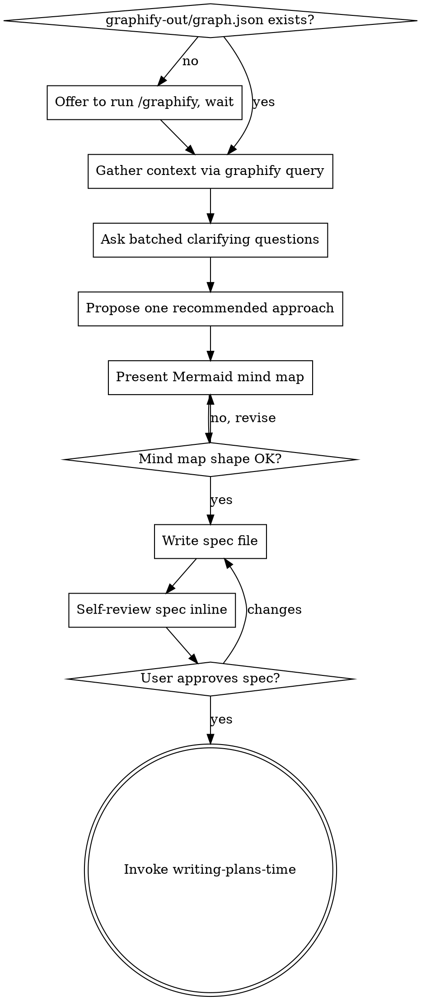
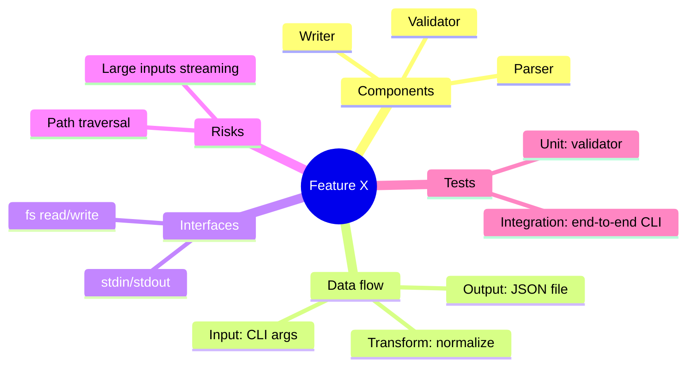

# Direct Brainstorming

Turn an idea into a reviewable spec quickly. Same goal as superpowers:brainstorming — never implement without an approved design — but with less back-and-forth, graphify-first context gathering, and a mind map review step before the written spec.

<HARD-GATE>
Do NOT write code, scaffold, or invoke any implementation skill until you have presented the mind map AND the written spec and the user has approved both. This applies regardless of perceived simplicity.
</HARD-GATE>

## When to Use

Use this skill instead of superpowers:brainstorming when:
- The user wants to move quickly and dislikes one-question-at-a-time interrogation
- The repo already has (or should have) a graphify knowledge graph
- A visual mind map of the proposed design would help the user review faster than prose

Use the standard superpowers:brainstorming skill when:
- The user explicitly wants the full visual-companion / multi-approach flow
- The project is large/ambiguous enough to need decomposition into sub-projects first

## Checklist

Create a TodoWrite todo for each item and complete them in order:

1. **Ensure graphify graph exists** — check for `graphify-out/graph.json`; if missing, offer to run `/graphify` and wait for the user before continuing
2. **Gather context via `graphify query`** — do NOT use Read/Grep for general exploration; only fall back to file reads when a query result is insufficient for a specific line/implementation
3. **Ask batched clarifying questions** — one message containing all open questions (use AskUserQuestion for choices); follow up only if answers reveal new unknowns
4. **Propose one recommended approach** — short paragraph, name the main tradeoff, name the alternative you rejected and why (one sentence)
5. **Present mind map** — a Mermaid `mindmap` of the design (root = feature name; branches = components, data flow, interfaces, risks, test surface); ask the user to confirm or correct the shape before writing prose
6. **Write the spec** — save to `docs/specs/YYYY-MM-DD-<topic>.md` (or the project's existing spec location if different); include the mind map at the top
7. **Spec self-review** — scan inline for placeholders, contradictions, ambiguity, scope creep; fix in place
8. **User reviews the spec file** — ask for approval or changes; loop until approved
9. **Hand off to writing-plans-time** — invoke `writing-plans-time` to produce the implementation plan; do not invoke any implementation skill directly

## Process Flow



The terminal state is invoking `writing-plans-time`. Do not jump to frontend-design, mcp-builder, or any other implementation skill.

## Graphify Integration (Required)

This is what makes the skill "direct": you read the codebase through the graph, not by opening files one at a time.

**Initialization gate.** Before any context gathering, check for `graphify-out/graph.json` in the project root:

```bash
test -f graphify-out/graph.json && echo present || echo missing
```

- If **present**: proceed.
- If **missing**: stop and offer:
  > "No graphify graph found here. I'd like to run `/graphify` first so I can answer design questions from the knowledge graph instead of reading files one by one. OK to initialize?"
  Wait for the user's reply. If they decline, fall back to normal file reads but note the limitation.

**Querying.** For every "where is X", "how does Y work", "what depends on Z", "what's the current shape of A" question, run:

```bash
graphify query "<question>"
```

Use Read/Grep only when:
- The query result is too high-level and you need an exact line or implementation detail
- The query returns nothing relevant (then both query and read, and consider that the graph may be stale)

**Staleness.** If the repo has changed substantially since the last graph build, suggest `graphify --update` before continuing.

## Mind Map Step (Required)

Before writing the spec, produce a Mermaid `mindmap` of the proposed design and present it for visual review. This is cheaper feedback than a written spec — users can spot a missing branch or a mis-shaped boundary in seconds.

**Minimum branches:**
- Components / modules
- Data flow (inputs → transforms → outputs)
- External interfaces (APIs, files, events)
- Risks / open questions
- Test surface

**Example shape:**



After presenting the mind map, ask one direct question: **"Does this shape match what you want, or is a branch missing/wrong?"** Iterate the mind map (not the prose) until the user confirms the shape. Only then write the spec.

## Spec File

- Default path: `docs/specs/YYYY-MM-DD-<topic>.md` (user preferences override)
- First section of the spec is the approved Mermaid mind map
- Then: purpose, scope, architecture, data flow, interfaces, error handling, testing, open questions
- Scale each section to its complexity — a few sentences is fine when the topic is small
- Commit the spec to git if the repo uses git

### Self-review (inline, no separate pass)

Before showing the user the spec file path:

- Any `TBD`, `TODO`, or vague requirement? Replace or remove.
- Any section that contradicts another? Reconcile.
- Any requirement readable two ways? Pick one explicitly.
- Is the scope still one implementation plan's worth of work? If not, flag decomposition.

Fix in place. Don't loop on self-review.

### User review gate

> "Spec written to `<path>` and mind map approved. Please review the file and tell me if you want changes before I hand off to `writing-plans-time`."

Loop until the user approves, then invoke `writing-plans-time`.

## How This Differs From superpowers:brainstorming

| superpowers:brainstorming | brainstorming-time |
|---|---|
| One question at a time | Batched questions in a single message |
| 2–3 approaches with tradeoffs | One recommended approach + one rejected alternative |
| Section-by-section design approval | Mind map first, then full spec at once |
| Optional visual companion (browser) | Mermaid mind map inline in the chat |
| Reads files directly for context | Reads via `graphify query`; initializes graphify if missing |
| Hand-off: superpowers:writing-plans | `writing-plans-time` (the rest of the direct-* chain) |

## Red Flags — Stop and Course-Correct

- About to call Read/Grep before running a single `graphify query` → stop, query first
- `graphify-out/` is missing and you proceeded anyway → stop, offer to initialize
- Writing the spec without showing a mind map → stop, mind map first
- Asking the user one question, getting an answer, then asking the next → batch them
- Proposing 2–3 approaches with full tradeoff tables → that's brainstorming, not this skill
- Invoking an implementation skill before user approves the written spec → hard gate violation

## Memory protocol (when run under /dev)

When this skill runs inside a `/dev` loop, read `.dev/memory/` **first**, before gathering context or asking clarifying questions:

- **Suppress re-asking** anything already settled in `goals.md`, `decisions.md`, or `glossary.md`. Do not re-ask settled questions — treat those decisions as fixed inputs to the spec.
- Append new design decisions made during the brainstorm to `.dev/memory/decisions.md` tagged `[interactive]` (see `dev-pipeline/memory-protocol.md` for the full entry format, including the `phase<N>/<stage>:` prefix), and append any new domain terms to `.dev/memory/glossary.md`.

See `dev-pipeline/memory-protocol.md` for the file formats. This step is a **no-op when `.dev/memory/` is absent** — the skill still runs standalone without it.

## Key Principles

- **Graph before file.** The graph is the entry point; files are the fallback.
- **Batch before drip.** One message of questions beats five rounds of one.
- **Picture before prose.** A mind map catches structural mistakes faster than a spec does.
- **One approach, named tradeoff.** Don't pad with alternatives the user didn't ask for.
- **Hard gate holds.** No code until the spec is approved, no matter how small the task looks.
- **Ponytail first rung.** Apply "does this need to exist?" to every proposed component; cut scope that fails it before it reaches the spec.
