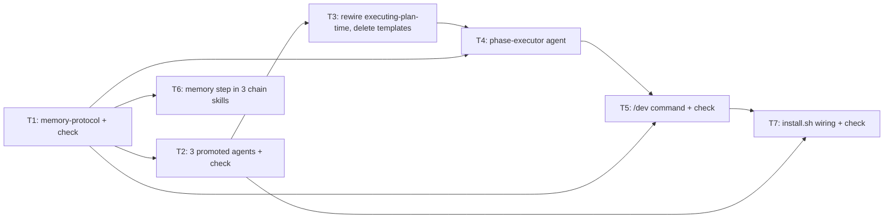

# /dev Continuous Loop — Implementation Plan

> **For agentic workers:** REQUIRED SUB-SKILL: Use `executing-plan-time` to run this plan. It handles worktree setup, overlap analysis, parallel-wave dispatch, per-task spec + code-quality review, and branch finishing in one runner. Steps use checkbox `- [ ]` syntax for tracking.

**Goal:** Add a `/dev "<idea>"` command that runs the local chain (project-time → brainstorming-time → writing-plans-time → executing-plan-time) continuously across a multi-phase roadmap, with a shared project-local `.dev/memory/` layer and per-phase subagent-isolated execution.

**Architecture:** New `dev-pipeline/` (command + 4 agents + memory-protocol), mirroring `ship-pipeline/`'s agents+command layout. The three `executing-plan-time/*-prompt.md` dispatch templates are promoted to named, memory-aware agent files; executing-plan-time is rewired to dispatch them by name. The four chain skills gain a memory read/write step. Each roadmap phase's execution is dispatched to a `phase-executor` subagent (fresh context, discarded on return; nested subagent dispatch confirmed working), keeping main context lean across the loop.

**Tech Stack:** Markdown skill/agent/command files + YAML frontmatter; Bash (`install.sh`, test checks); `jq` (settings, already used).

**Max wave width:** 2 tasks in parallel at peak (W2: T2 ∥ T6).

**Spec:** `docs/specs/2026-06-17-dev-continuous-loop.md`

---

## File Edit Manifest

| Path | Action | Purpose | First touched in |
|------|--------|---------|------------------|
| `dev-pipeline/memory-protocol.md` | Create | Shared `.dev/memory/` read/write contract referenced by all stages | Task 1 |
| `tests/dev/check_memory_protocol.sh` | Create | Assert protocol structure + a memory-roundtrip simulation | Task 1 |
| `dev-pipeline/agents/implementer.md` | Create | Promoted, memory-aware implementer agent | Task 2 |
| `dev-pipeline/agents/spec-reviewer.md` | Create | Promoted, memory-aware spec-compliance reviewer | Task 2 |
| `dev-pipeline/agents/code-quality-reviewer.md` | Create | Promoted, memory-aware code-quality reviewer | Task 2 |
| `tests/dev/check_agents.sh` | Create | Assert agent frontmatter + memory-protocol section present | Task 2 |
| `executing-plan-time/SKILL.md` | Modify | Dispatch promoted agents by name; add memory-protocol step | Task 3 |
| `executing-plan-time/implementer-prompt.md` | Delete | Superseded by `dev-pipeline/agents/implementer.md` | Task 3 |
| `executing-plan-time/spec-reviewer-prompt.md` | Delete | Superseded by `dev-pipeline/agents/spec-reviewer.md` | Task 3 |
| `executing-plan-time/code-quality-reviewer-prompt.md` | Delete | Superseded by `dev-pipeline/agents/code-quality-reviewer.md` | Task 3 |
| `dev-pipeline/agents/phase-executor.md` | Create | Per-phase exec subagent; runs executing-plan-time on one plan | Task 4 |
| `dev-pipeline/commands/dev.md` | Create | `/dev` orchestrator: roadmap + phase loop + resume + escalation policy | Task 5 |
| `tests/dev/check_dev_command.sh` | Create | Assert dev.md encodes loop, resume, memory, escalation contract | Task 5 |
| `project-time/SKILL.md` | Modify | Write roadmap to `.dev/memory/`; seed `progress.md` | Task 6 |
| `brainstorming-time/SKILL.md` | Modify | Memory read/write step; suppress settled questions | Task 6 |
| `writing-plans-time/SKILL.md` | Modify | Memory read/write step | Task 6 |
| `install.sh` | Modify | Install `dev-pipeline/` command + agents | Task 7 |
| `tests/dev/check_install.sh` | Create | Assert install.sh references the dev command + 4 dev agents | Task 7 |

**Out of scope (intentionally not touched):** `ship-pipeline/*` (its own door stays as-is), `caveman/*`, `graphify/`, `README.md`, the runtime `.dev/memory/*.md` files (created at runtime by `/dev`, not shipped).

---

## Execution Waves



| Wave | Tasks | Parallelizable | Rationale |
|------|-------|----------------|-----------|
| W1 | T1 | n/a (single) | Bootstraps the contract everything else cites |
| W2 | T2, T6 | yes — disjoint files (`dev-pipeline/agents/*` vs chain `*/SKILL.md`) | Both depend only on T1 |
| W3 | T3 | n/a | Rewires executing-plan-time to reference T2's agents; deletes templates |
| W4 | T4 | n/a | phase-executor invokes the rewired skill |
| W5 | T5 | n/a | `/dev` dispatches the phase-executor |
| W6 | T7 | n/a | Install wiring needs the command + agents to exist |

---

## Task 1: Memory protocol + structure check

**Depends-on:** none
**Wave:** W1
**Files:**
- Create: `dev-pipeline/memory-protocol.md`
- Test: `tests/dev/check_memory_protocol.sh`

- [ ] **Step 1: Write the failing test**
```bash
# tests/dev/check_memory_protocol.sh
set -euo pipefail
ROOT="$(cd "$(dirname "$0")/../.." && pwd)"
P="$ROOT/dev-pipeline/memory-protocol.md"
test -f "$P" || { echo "FAIL: memory-protocol.md missing"; exit 1; }
for f in goals.md decisions.md lessons.md glossary.md progress.md; do
  grep -q "$f" "$P" || { echo "FAIL: protocol does not document $f"; exit 1; }
done
grep -qi "read order" "$P" || { echo "FAIL: no read-order section"; exit 1; }
grep -qi "lesson" "$P" || { echo "FAIL: no lesson-detection rule"; exit 1; }
grep -Eqi "\[auto\]|\[escalated\]|\[interactive\]" "$P" || { echo "FAIL: no decision tags"; exit 1; }
# memory roundtrip: a write by one stage is readable by the next
TMP="$(mktemp -d)"; mkdir -p "$TMP/.dev/memory"
printf '%s\n' '- [auto] phase1/exec: chose list over set — order matters' >> "$TMP/.dev/memory/decisions.md"
grep -q "chose list over set" "$TMP/.dev/memory/decisions.md" || { echo "FAIL: roundtrip"; exit 1; }
rm -rf "$TMP"
echo "PASS"
```
- [ ] **Step 2: Run test to verify it fails**
  Run: `bash tests/dev/check_memory_protocol.sh`
  Expected: FAIL with "memory-protocol.md missing"
- [ ] **Step 3: Write `dev-pipeline/memory-protocol.md`** with these exact sections:
  - **Location:** project-local `.dev/memory/`, git-tracked, created by `/dev` at runtime if absent.
  - **Files & writer-domain:**
    - `goals.md` — project goals + non-functional constraints. Writer: project-time. Downstream: read-only unless user changes goals.
    - `decisions.md` — **every** decision + **why**, by any stage. Each line tagged `[interactive]` / `[auto]` / `[escalated]` and prefixed `phase<N>/<stage>:`. The single audit log.
    - `lessons.md` — lessons from user corrections. Entry format three lines: the lesson, `**Why:**`, `**How to apply:**`.
    - `glossary.md` — domain terms, appended on first definition.
    - `progress.md` — phases with status `pending` / `planned` / `done`. Writers: `/dev` orchestrator + phase-executor only.
  - **Read order** (start of every stage): goals → decisions → glossary → lessons → progress.
  - **Settled-question suppression:** interactive stages must not re-ask anything already fixed in goals/decisions/glossary.
  - **Lesson-detection heuristic:** capture when the user corrects, rejects a proposal, states a preference, or says "no, do X instead"; normal answers are not lessons.
  - **Append-only:** stages append; they do not rewrite existing entries.
- [ ] **Step 4: Run test to verify it passes**
  Run: `bash tests/dev/check_memory_protocol.sh`
  Expected: PASS
- [ ] **Step 5: Commit**
```bash
git add dev-pipeline/memory-protocol.md tests/dev/check_memory_protocol.sh
git commit -m "feat(dev): add .dev/memory protocol + structure check"
```

---

## Task 2: Promote the three executing-plan-time templates to memory-aware agents

**Depends-on:** [task-1]
**Wave:** W2
**Files:**
- Create: `dev-pipeline/agents/implementer.md`
- Create: `dev-pipeline/agents/spec-reviewer.md`
- Create: `dev-pipeline/agents/code-quality-reviewer.md`
- Test: `tests/dev/check_agents.sh`

- [ ] **Step 1: Write the failing test**
```bash
# tests/dev/check_agents.sh
set -euo pipefail
ROOT="$(cd "$(dirname "$0")/../.." && pwd)"
for a in implementer spec-reviewer code-quality-reviewer phase-executor; do
  f="$ROOT/dev-pipeline/agents/$a.md"
  test -f "$f" || { echo "FAIL: agent $a.md missing"; exit 1; }
  head -1 "$f" | grep -q '^---$' || { echo "FAIL: $a missing frontmatter"; exit 1; }
  grep -q "^name: $a$" "$f" || { echo "FAIL: $a name mismatch"; exit 1; }
  grep -q "^description:" "$f" || { echo "FAIL: $a no description"; exit 1; }
  grep -qi "memory-protocol\|\.dev/memory" "$f" || { echo "FAIL: $a no memory protocol ref"; exit 1; }
done
echo "PASS"
```
  Note: this check also covers `phase-executor` (Task 4) — Task 2 makes the three worker agents pass; Task 4 makes the fourth pass.
- [ ] **Step 2: Run test to verify it fails**
  Run: `bash tests/dev/check_agents.sh`
  Expected: FAIL with "agent implementer.md missing"
- [ ] **Step 3: Create the three agent files.** For each, take the body of the corresponding source template and wrap it:
  - Source bodies: `executing-plan-time/implementer-prompt.md` → `implementer.md`; `executing-plan-time/spec-reviewer-prompt.md` → `spec-reviewer.md`; `executing-plan-time/code-quality-reviewer-prompt.md` → `code-quality-reviewer.md`.
  - Prepend YAML frontmatter:
    - `implementer.md`: `name: implementer`, `description:` "Implements one plan task under the TDD-before-commit contract inside a worktree. Memory-aware. Dispatched per task by executing-plan-time.", `tools: Read, Write, Edit, Grep, Glob, Bash`, `model: sonnet`.
    - `spec-reviewer.md`: `name: spec-reviewer`, `description:` "Spec-compliance + TDD-artifact reviewer for one completed task. Read-only. Memory-aware.", `tools: Read, Grep, Glob, Bash`, `model: opus`.
    - `code-quality-reviewer.md`: `name: code-quality-reviewer`, `description:` "Code-quality + sibling-conflict reviewer for one completed task. Read-only. Memory-aware.", `tools: Read, Grep, Glob, Bash`, `model: opus`.
  - Insert directly after the frontmatter, before the original body, a `## Memory protocol` section: "Before starting, read `.dev/memory/` per `dev-pipeline/memory-protocol.md` (goals → decisions → glossary → lessons). Append any new decision to `decisions.md` tagged `[auto]` or `[escalated]` with a `phase<N>/<stage>:` prefix; append a lesson to `lessons.md` if the dispatcher's instructions reflect a user correction. Do not rewrite existing entries."
  - Preserve the original template body verbatim below that section (the TDD/review/manifest discipline is unchanged).
- [ ] **Step 4: Run test to verify the three worker agents pass**
  Run: `bash tests/dev/check_agents.sh`
  Expected: FAIL only on "agent phase-executor.md missing" (the three worker agents now pass; phase-executor is Task 4). Confirm the failure line names `phase-executor`, proving implementer/spec-reviewer/code-quality-reviewer passed their checks.
- [ ] **Step 5: Commit**
```bash
git add dev-pipeline/agents/implementer.md dev-pipeline/agents/spec-reviewer.md dev-pipeline/agents/code-quality-reviewer.md tests/dev/check_agents.sh
git commit -m "feat(dev): promote executing-plan-time templates to memory-aware agents"
```

---

## Task 3: Rewire executing-plan-time to dispatch the named agents; delete templates

**Depends-on:** [task-2]
**Wave:** W3
**Files:**
- Modify: `executing-plan-time/SKILL.md`
- Delete: `executing-plan-time/implementer-prompt.md`
- Delete: `executing-plan-time/spec-reviewer-prompt.md`
- Delete: `executing-plan-time/code-quality-reviewer-prompt.md`

- [ ] **Step 1: Write the failing test**
```bash
# inline check (no new test file; reuse a one-off assertion)
ROOT="$(git rev-parse --show-toplevel)"
S="$ROOT/executing-plan-time/SKILL.md"
grep -q "dev-pipeline/agents/implementer" "$S" \
  && ! test -e "$ROOT/executing-plan-time/implementer-prompt.md" \
  && grep -qi "memory-protocol\|\.dev/memory" "$S" \
  && echo "PASS" || { echo "FAIL"; exit 1; }
```
- [ ] **Step 2: Run test to verify it fails**
  Run: paste Step 1 into a shell.
  Expected: FAIL (SKILL.md still references the prompt templates; files still exist)
- [ ] **Step 3: Edit `executing-plan-time/SKILL.md`:**
  - Replace the "Companion templates" block and every `implementer-prompt.md` / `spec-reviewer-prompt.md` / `code-quality-reviewer-prompt.md` reference with dispatch-by-name to the agents `implementer`, `spec-reviewer`, `code-quality-reviewer` (located at `dev-pipeline/agents/`). The dispatch instruction becomes "dispatch the `implementer` agent with the task slice" etc., keeping the existing constraints (worktree, manifest, TDD triple, two-stage review order) in prose.
  - Add one step to the Pre-flight/Checklist: "Read `.dev/memory/` per `dev-pipeline/memory-protocol.md` if present; pass memory pointers to each dispatched agent."
  - Keep all four HARD-GATE invariants unchanged.
- [ ] **Step 4: Delete the three superseded templates**
```bash
git rm executing-plan-time/implementer-prompt.md executing-plan-time/spec-reviewer-prompt.md executing-plan-time/code-quality-reviewer-prompt.md
```
- [ ] **Step 5: Run test to verify it passes**
  Run: Step 1 assertion.
  Expected: PASS
- [ ] **Step 6: Commit**
```bash
git add executing-plan-time/SKILL.md
git commit -m "refactor(exec): dispatch named dev agents + memory step; drop inline templates"
```

---

## Task 4: phase-executor agent

**Depends-on:** [task-3, task-1]
**Wave:** W4
**Files:**
- Create: `dev-pipeline/agents/phase-executor.md`

- [ ] **Step 1: Failing test** — already encoded in `tests/dev/check_agents.sh` (it asserts `phase-executor.md`).
  Run: `bash tests/dev/check_agents.sh`
  Expected: FAIL with "agent phase-executor.md missing"
- [ ] **Step 2: Create `dev-pipeline/agents/phase-executor.md`** with frontmatter `name: phase-executor`, `description:` "Runs one roadmap phase's plan to done in an isolated context. Invokes the executing-plan-time skill (worktree, parallel waves, TDD, two-stage review, finishing). Memory-aware. Dispatched per phase by /dev.", `tools: Read, Write, Edit, Grep, Glob, Bash, Skill, Agent`, `model: opus`. Body requirements:
  - `## Memory protocol` section (same as Task 2 agents): read `.dev/memory/` first; append all decisions to `decisions.md` tagged `[auto]`/`[escalated]` with `phase<N>/exec:` prefix.
  - **Blocking-ambiguity policy:** irreversible fork (external behavior / schema / API / data / hard-to-undo) → STOP and return an `ESCALATE:` block naming the fork + options to the caller; do not guess. Reversible fork → pick the sensible default, continue, log `[auto]`.
  - **Procedure:** invoke the `executing-plan-time` skill on the plan path passed by `/dev`. If the `Skill` tool is unavailable to subagents in this harness (verify at runtime — see Risks), inline executing-plan-time's checklist instead.
  - **Return contract:** a ≤10-line summary — phase id, tasks done, tests/lint/types status, branch/worktree disposition, any `ESCALATE:` block, and the count of `decisions.md` entries added.
- [ ] **Step 3: Run test to verify it passes**
  Run: `bash tests/dev/check_agents.sh`
  Expected: PASS
- [ ] **Step 4: Commit**
```bash
git add dev-pipeline/agents/phase-executor.md
git commit -m "feat(dev): add phase-executor subagent for isolated per-phase execution"
```

---

## Task 5: `/dev` command (orchestrator + phase loop)

**Depends-on:** [task-4, task-1]
**Wave:** W5
**Files:**
- Create: `dev-pipeline/commands/dev.md`
- Test: `tests/dev/check_dev_command.sh`

- [ ] **Step 1: Write the failing test**
```bash
# tests/dev/check_dev_command.sh
set -euo pipefail
ROOT="$(cd "$(dirname "$0")/../.." && pwd)"
D="$ROOT/dev-pipeline/commands/dev.md"
test -f "$D" || { echo "FAIL: dev.md missing"; exit 1; }
for k in '\$ARGUMENTS' 'progress.md' '\.dev/memory' 'phase-executor' \
         'project-time' 'brainstorming-time' 'writing-plans-time' \
         'resume' 'escalat' 'irreversible' 'reversible'; do
  grep -Eqi "$k" "$D" || { echo "FAIL: dev.md missing contract: $k"; exit 1; }
done
echo "PASS"
```
- [ ] **Step 2: Run test to verify it fails**
  Run: `bash tests/dev/check_dev_command.sh`
  Expected: FAIL with "dev.md missing"
- [ ] **Step 3: Write `dev-pipeline/commands/dev.md`** (orchestrator prose, `ship.md` style — sequential, confirm handoff files exist before advancing). Encode exactly:
  1. Run for: `$ARGUMENTS`. On invoke, ensure `.dev/memory/` exists (create skeleton files from `dev-pipeline/memory-protocol.md` if absent); read `progress.md`.
  2. If the idea is multi-feature and no roadmap exists → run `project-time` (interactive); it writes `goals.md`, seeds `decisions.md`/`glossary.md`, and seeds `progress.md` phases as `pending`. Single feature → `progress.md` gets one phase.
  3. **Phase loop** over the next non-`done` phase:
     a. Read `.dev/memory/` (feeds context, suppresses settled questions).
     b. Run `brainstorming-time` (interactive, main) → spec file.
     c. Run `writing-plans-time` (main) → plan file.
     d. Set phase `planned` in `progress.md`; persist new decisions/glossary.
     e. **Dispatch the `phase-executor` agent** with the plan path + memory pointers + phase id. Await its ≤10-line summary.
     f. If the summary contains `ESCALATE:` → stop, surface to user, record resolution in `decisions.md` `[escalated]`, then resume.
     g. Set phase `done`; record the summary. Advance to the next phase.
  4. All phases `done` → final report; do not merge unless the user authorized it (executing-plan-time's finishing handoff governs per phase).
  - **Resume contract:** state that re-invoking `/dev` reads `progress.md` and continues at the first non-`done` phase; completed phases are never re-run.
  - **Context note:** because each phase executes inside the `phase-executor` subagent, main holds only loop state + one summary per phase.
  - **Decision logging:** every decision (interactive, auto, escalated) lands in `decisions.md` for review.
- [ ] **Step 4: Run test to verify it passes**
  Run: `bash tests/dev/check_dev_command.sh`
  Expected: PASS
- [ ] **Step 5: Commit**
```bash
git add dev-pipeline/commands/dev.md tests/dev/check_dev_command.sh
git commit -m "feat(dev): add /dev continuous roadmap loop command"
```

---

## Task 6: Add memory read/write step to the three chain skills

**Depends-on:** [task-1]
**Wave:** W2
**Files:**
- Modify: `project-time/SKILL.md`
- Modify: `brainstorming-time/SKILL.md`
- Modify: `writing-plans-time/SKILL.md`

- [ ] **Step 1: Write the failing test**
```bash
# inline check
ROOT="$(git rev-parse --show-toplevel)"
ok=1
for s in project-time brainstorming-time writing-plans-time; do
  grep -qi "\.dev/memory\|memory-protocol" "$ROOT/$s/SKILL.md" || { echo "FAIL: $s"; ok=0; }
done
grep -qi "seed.*progress\|progress.md" "$ROOT/project-time/SKILL.md" || { echo "FAIL: project-time progress seed"; ok=0; }
grep -qi "suppress\|already.*settled\|do not re-ask\|don't re-ask" "$ROOT/brainstorming-time/SKILL.md" || { echo "FAIL: brainstorming suppress"; ok=0; }
[ "$ok" = 1 ] && echo "PASS" || exit 1
```
- [ ] **Step 2: Run test to verify it fails**
  Run: paste Step 1.
  Expected: FAIL (skills don't yet mention memory)
- [ ] **Step 3: Edit each skill** (additive — a short "## Memory protocol (when run under /dev)" subsection; do not restructure existing flow):
  - `project-time/SKILL.md`: after producing the roadmap, write `goals.md` (goals + non-functional targets), seed `decisions.md`/`glossary.md` with resolved project-level choices, and seed `progress.md` with one `pending` entry per milestone. Reference `dev-pipeline/memory-protocol.md`.
  - `brainstorming-time/SKILL.md`: at context-gathering, read `.dev/memory/` first and **suppress re-asking** anything already settled in goals/decisions/glossary; append new design decisions to `decisions.md` (`[interactive]`) and new terms to `glossary.md`.
  - `writing-plans-time/SKILL.md`: read `.dev/memory/` before building the manifest; append any planning decisions to `decisions.md` (`[interactive]`).
  - Each subsection notes these steps are **no-ops when `.dev/memory/` is absent** (skills still run standalone).
- [ ] **Step 4: Run test to verify it passes**
  Run: Step 1 assertion.
  Expected: PASS
- [ ] **Step 5: Commit**
```bash
git add project-time/SKILL.md brainstorming-time/SKILL.md writing-plans-time/SKILL.md
git commit -m "feat(chain): wire .dev/memory read/write into the three planning skills"
```

---

## Task 7: Install dev-pipeline via install.sh

**Depends-on:** [task-5, task-2]
**Wave:** W6
**Files:**
- Modify: `install.sh`
- Test: `tests/dev/check_install.sh`

- [ ] **Step 1: Write the failing test**
```bash
# tests/dev/check_install.sh
set -euo pipefail
ROOT="$(cd "$(dirname "$0")/../.." && pwd)"
I="$ROOT/install.sh"
grep -q "dev-pipeline/commands" "$I" || { echo "FAIL: dev command not installed"; exit 1; }
grep -q "dev-pipeline/agents" "$I" || { echo "FAIL: dev agents not installed"; exit 1; }
for a in implementer spec-reviewer code-quality-reviewer phase-executor; do
  grep -q "$a" "$I" || { echo "FAIL: dev agent $a not listed"; exit 1; }
done
grep -q "\bdev\b" "$I" || { echo "FAIL: /dev command not listed"; exit 1; }
bash -n "$I" || { echo "FAIL: install.sh syntax"; exit 1; }
echo "PASS"
```
- [ ] **Step 2: Run test to verify it fails**
  Run: `bash tests/dev/check_install.sh`
  Expected: FAIL with "dev command not installed"
- [ ] **Step 3: Edit `install.sh`:**
  - Add `DEV_AGENTS=(implementer spec-reviewer code-quality-reviewer phase-executor)` and `DEV_COMMANDS=(dev)` near the existing `AGENTS`/`COMMANDS` arrays (line 12-15).
  - After the existing agent/command install loops (lines 147-155), add loops that `install_item` from `$SCRIPT_DIR/dev-pipeline/agents/$a.md` → `$AGENTS_DIR/$a.md` and `$SCRIPT_DIR/dev-pipeline/commands/$c.md` → `$COMMANDS_DIR/$c.md`. Reuse the existing `install_item` helper and `$AGENTS_DIR`/`$COMMANDS_DIR`.
  - Update the closing "Done." echo (line 162) to mention `/dev`.
- [ ] **Step 4: Run test to verify it passes**
  Run: `bash tests/dev/check_install.sh`
  Expected: PASS
- [ ] **Step 5: Full suite sanity**
  Run: `for t in tests/dev/*.sh; do echo "== $t"; bash "$t"; done`
  Expected: every script prints PASS
- [ ] **Step 6: Commit**
```bash
git add install.sh tests/dev/check_install.sh
git commit -m "feat(dev): install dev-pipeline command + agents"
```

---

## Notes / Risks

- **Skill-from-subagent (spec open question 1).** `phase-executor` is granted the `Skill` tool and instructed to invoke `executing-plan-time`. If this harness blocks subagent skill invocation, Task 4's fallback (inline executing-plan-time's checklist into the agent) applies — verify at execution time before marking Task 4 done.
- **Nested dispatch** is confirmed working (probe: subagent spawned a sub-subagent successfully), so `phase-executor` → executing-plan-time → `implementer`/reviewers is sound.
- **Standalone skills unaffected.** All memory steps are no-ops when `.dev/memory/` is absent, so project-time/brainstorming-time/writing-plans-time still work outside `/dev`.
- **`/ship` untouched** — separate door for single one-wave features.
