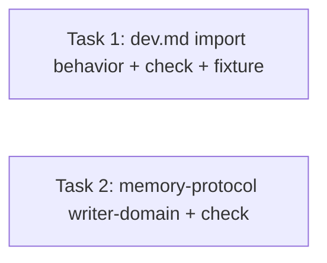

# /dev Roadmap Import — Implementation Plan

> **For agentic workers:** REQUIRED SUB-SKILL: Use `executing-plan-time` to run this plan. It handles worktree setup, overlap analysis, parallel-wave dispatch, per-task spec + code-quality review, and branch finishing in one runner. Steps use checkbox `- [ ]` syntax for tracking.

**Goal:** Let `/dev` seed `.dev/memory/progress.md` from an existing roadmap doc (auto-detected or `--import`ed) instead of re-running `project-time`, with a completion prompt so the loop resumes at a mid-roadmap milestone.

**Architecture:** Behavior-only change to the `/dev` orchestrator prose (`pipelines/dev-pipeline/commands/dev.md`, Roadmap stage §2 + an Import subsection) plus a one-line writer-domain note in `pipelines/dev-pipeline/memory-protocol.md`. No new agent/command/parser — the orchestrator performs the parse per a documented rule. Tests are bash assertions over the doc text plus one parse-simulation over a committed fixture.

**Tech Stack:** Markdown (orchestrator/command prose); Bash + grep/awk (test checks + parse simulation).

**Max wave width:** 2 tasks in parallel (W1: T1 ∥ T2).

**Spec:** `docs/specs/2026-06-17-roadmap-import.md`

---

## File Edit Manifest

| Path | Action | Purpose | First touched in |
|------|--------|---------|------------------|
| `pipelines/dev-pipeline/commands/dev.md` | Modify | Add roadmap-import behavior to the Roadmap stage (§2) + an Import subsection | Task 1 |
| `tests/dev/check_roadmap_import.sh` | Create | Assert dev.md documents the import contract + parse-simulation over the fixture | Task 1 |
| `tests/dev/fixtures/roadmap-sample.md` | Create | Fixture roadmap (4 milestones + `## Goals`) for the parse simulation | Task 1 |
| `pipelines/dev-pipeline/memory-protocol.md` | Modify | Name roadmap import (alongside project-time) as a `progress.md` seeder | Task 2 |
| `tests/dev/check_memory_protocol.sh` | Modify | Assert the `progress.md` writer-domain names import as a seeder | Task 2 |

**Out of scope (intentionally not touched):** `docs/specs/2026-06-17-roadmap-import.md` (the spec itself), the four dev agents, `install.sh`, `ship-pipeline/*`, the **status-aware resume** enhancement (separate feature: resuming a `planned`/in-flight phase at its existing plan).

---

## Execution Waves



| Wave | Tasks | Parallelizable | Rationale |
|------|-------|----------------|-----------|
| W1 | T1, T2 | yes — disjoint files | T1 touches `dev.md` + `check_roadmap_import.sh` + `fixtures/`; T2 touches `memory-protocol.md` + `check_memory_protocol.sh`. No shared file, no dependency. |

Both tasks are independent (neither depends on the other; file sets disjoint), so they form a single parallel wave of width 2.

---

## Task 1: dev.md roadmap-import behavior + check + fixture

**Depends-on:** none
**Wave:** W1
**Files:**
- Modify: `pipelines/dev-pipeline/commands/dev.md` (Roadmap stage §2)
- Create: `tests/dev/check_roadmap_import.sh`
- Create: `tests/dev/fixtures/roadmap-sample.md`

- [ ] **Step 1: Write the fixture** `tests/dev/fixtures/roadmap-sample.md` with EXACTLY this content:
```markdown
# Sample Project Roadmap

## Goals
- Ship a billing system
- Keep p99 < 200ms

## Milestone 1: Auth foundation
Scope: login, sessions.

## Milestone 2: User profiles
Scope: profile CRUD.

## Milestone 3: Billing
Scope: Stripe integration.

## Milestone 4: Admin console
Scope: admin views.
```

- [ ] **Step 2: Write the failing test** `tests/dev/check_roadmap_import.sh` with EXACTLY this content:
```bash
# tests/dev/check_roadmap_import.sh
set -euo pipefail
ROOT="$(cd "$(dirname "$0")/../.." && pwd)"
D="$ROOT/pipelines/dev-pipeline/commands/dev.md"
F="$ROOT/tests/dev/fixtures/roadmap-sample.md"
test -f "$D" || { echo "FAIL: dev.md missing"; exit 1; }

# --- dev.md documents the import contract ---
for kw in 'roadmap' 'ROADMAP\.md' '\.dev/roadmap\.md' 'docs/roadmap\.md' \
          '--import' '--force' 'Milestone' 'pending' 'Goals' 'goals\.md' \
          'complete' 'detect'; do
  grep -Eqi "$kw" "$D" || { echo "FAIL: dev.md missing import contract: $kw"; exit 1; }
done

# --- parse simulation: reference impl of the documented milestone rule ---
test -f "$F" || { echo "FAIL: fixture missing"; exit 1; }
mcount=$(grep -Ec '^## (Milestone|Phase|M[0-9]|[0-9]+[.)])' "$F")
[ "$mcount" -eq 4 ] || { echo "FAIL: expected 4 milestone headings, got $mcount"; exit 1; }
first=$(grep -E '^## (Milestone|Phase|M[0-9]|[0-9]+[.)])' "$F" | head -1)
echo "$first" | grep -q "Auth foundation" || { echo "FAIL: first milestone not Auth foundation"; exit 1; }
goals=$(awk '/^## Goals$/{f=1;next} /^## /{f=0} f' "$F")
echo "$goals" | grep -qi "billing system" || { echo "FAIL: goals body not extracted"; exit 1; }
echo "PASS"
```

- [ ] **Step 3: Run test to verify it fails**
  Run: `bash tests/dev/check_roadmap_import.sh`
  Expected: FAIL on a `dev.md missing import contract: ...` line (the contract keywords are not in dev.md yet). The fixture/parse-sim portion is satisfied; the doc-assertion portion fails.

- [ ] **Step 4: Edit `pipelines/dev-pipeline/commands/dev.md`** — replace the current `## 2. Roadmap` section with EXACTLY:
````markdown
## 2. Roadmap

Decide how `progress.md` gets its phases:

- **Explicit import** — if invoked as `/dev --import <path> [...]`: seed from `<path>` (see Import below). If `progress.md` already has phases, refuse unless `--force` is also given: "progress.md already has phases; re-run with --force to overwrite."
- **Auto-detect import** — else if `progress.md` has no phases, scan in order `.dev/roadmap.md`, `ROADMAP.md`, `docs/roadmap.md`; if one exists, offer: "Found <path>. Import it as the phase list?" On yes, import it (see Import below).
- **project-time** — else if the idea is multi-feature and `progress.md` is empty, run the `project-time` skill (interactive). It writes `goals.md`, seeds `decisions.md`/`glossary.md`, and seeds `progress.md` phases as `pending`.
- **Single feature** — else `progress.md` gets one phase.
- If `progress.md` already has phases and no `--import` was given, skip seeding and resume the loop (see Resume).

### Import

Seed `progress.md` from a markdown roadmap (the shape `project-time` emits):

1. **Parse milestones.** A phase is each markdown heading at the shallowest heading level that has ≥2 occurrences whose text matches a milestone pattern — text begins with `Milestone`, `M<number>`, `Phase`, or a leading `<number>.`/`<number>)` (case-insensitive). Strip that leading ordinal from the phase name; keep document order. If no heading matches, report that milestones could not be identified and fall back to the project-time / single-feature paths above — do not guess.
2. **Seed phases** into `progress.md`, all `pending`, in document order.
3. **Goals (optional).** If the file has a `## Goals` section (heading text exactly `Goals`) and `goals.md` is empty, copy that section's body (up to the next same-or-shallower heading) into `goals.md`. Never overwrite a non-empty `goals.md`.
4. **Conflict guard.** If `progress.md` already had phases: auto-detect does not import at all; explicit `--import` refuses unless `--force`, which replaces the phase list wholesale.
5. **Completion prompt.** Phases import as `pending`, so ask: "Imported N milestones, all pending — which are already complete? I'll mark them `done` so /dev resumes at the first incomplete one. (e.g. `1-3`, or `none`)." Mark the named phases `done`. The orchestrator owns these `progress.md` writes.

A bad explicit `--import` path is reported and stops (do not silently auto-detect a different file).
````

- [ ] **Step 5: Run test to verify it passes**
  Run: `bash tests/dev/check_roadmap_import.sh`
  Expected: PASS

- [ ] **Step 6: Commit**
```bash
git add pipelines/dev-pipeline/commands/dev.md tests/dev/check_roadmap_import.sh tests/dev/fixtures/roadmap-sample.md
git commit -m "feat(dev): roadmap import in /dev Roadmap stage"
```

---

## Task 2: memory-protocol writer-domain names import as a seeder

**Depends-on:** none
**Wave:** W1
**Files:**
- Modify: `pipelines/dev-pipeline/memory-protocol.md` (the `progress.md` writer-domain line)
- Modify: `tests/dev/check_memory_protocol.sh` (add one assertion)

- [ ] **Step 1: Write the failing test** — append this assertion to `tests/dev/check_memory_protocol.sh` immediately **before** its final `echo "PASS"` line:
```bash
# roadmap import is recognized as a progress.md seeder (alongside project-time)
awk '/progress\.md/{f=4} f>0{print; f--}' "$P" | grep -qi "import" || { echo "FAIL: import not named as progress.md seeder"; exit 1; }
```
  (The existing script defines `P` as the path to `memory-protocol.md` and ends with `echo "PASS"`; insert the block above that line. Do not change any existing assertion.)

- [ ] **Step 2: Run test to verify it fails**
  Run: `bash tests/dev/check_memory_protocol.sh`
  Expected: FAIL with `FAIL: import not named as progress.md seeder` (memory-protocol.md does not mention import yet).

- [ ] **Step 3: Edit `pipelines/dev-pipeline/memory-protocol.md`** — change the `progress.md` writer-domain line (currently: `Writers: project-time seeds the initial phase list; thereafter only the \`/dev\` orchestrator updates phase status.`) to read EXACTLY:
```markdown
  `progress.md` — phases with status `pending` / `planned` / `done`. Writers:
  project-time **or roadmap import** seeds the initial phase list; thereafter
  only the `/dev` orchestrator updates phase status.
```
  Keep the surrounding list formatting intact; this is a single-line wording change that adds "or roadmap import".

- [ ] **Step 4: Run test to verify it passes**
  Run: `bash tests/dev/check_memory_protocol.sh`
  Expected: PASS

- [ ] **Step 5: Commit**
```bash
git add pipelines/dev-pipeline/memory-protocol.md tests/dev/check_memory_protocol.sh
git commit -m "docs(dev): name roadmap import as a progress.md seeder"
```

---

## Notes

- **Why orchestrator-parsed, not a script:** the spec deliberately keeps import as orchestrator behavior (consistent with how the rest of `/dev` is specified). The parse-simulation in Task 1 is a *reference* check that the documented rule is precise enough to implement and extracts the right phases/order — it is not the production parser.
- **Both tasks are doc-grounded TDD:** the "test" asserts the documented contract + (T1) a fixture parse. No production code path is unit-testable because the model performs the parse at runtime; the fixture sim is the closest behavioral proof.
- **Resume gap not addressed here:** importing yields `pending`/`done` phases only. Resuming a `planned`/in-flight phase at its existing plan is the separate status-aware-resume feature.
