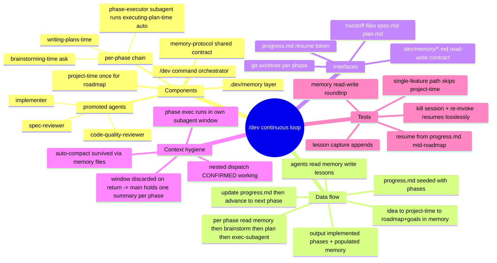

# Spec: `/dev` — continuous roadmap-driven dev loop

Date: 2026-06-17
Status: approved-pending (awaiting user sign-off → writing-plans-time)

## Mind map (approved)



## Purpose

One front door, `/dev "<idea>"`, that runs the full local chain
(project-time → brainstorming-time → writing-plans-time → executing-plan-time)
continuously across a multi-phase roadmap, advancing phase-to-phase on its own,
while sharing a project-local memory layer across every skill and agent.

`/dev` is the chain's sugar wrapper. `/ship` stays the lighter door for a single
one-wave feature. Routing in CLAUDE.md is unchanged; `/dev` just sequences the
chain the way `ship.md` sequences agents.

## Decisions (locked with user)

1. **Interactivity boundary — plan per phase, exec continuous.** When a phase is
   reached: brainstorming-time + writing-plans-time run **interactively in main**
   (they may ask the user questions). Execution runs **unattended in a subagent**.
   After exec, auto-advance to the next phase and brainstorm it (asks again).
2. **Context hygiene — subagent-per-phase execution.** Each phase's execution runs
   inside its own subagent (fresh context window, discarded on return). Main holds
   only loop state + memory pointers + one ≤10-line summary per phase. The model
   does **not** self-trigger `/clear` or `/compact` (no such tool exists); it does
   not need to, because the heavy work lives in throwaway windows. If the harness
   auto-compacts near the limit, the memory files make resume lossless.
   **Nested subagent dispatch is confirmed working in this harness** (probe:
   subagent spawned a sub-subagent, `PONG` returned), so the phase subagent can run
   executing-plan-time's parallel implementers + independent two-stage review.
3. **Memory layer — project-local `.dev/memory/` structured.** Git-tracked, travels
   with the repo. Files: `goals.md`, `decisions.md`, `lessons.md`, `glossary.md`,
   `progress.md`. Every skill/agent reads it first and appends after.
4. **Loop driver — `/dev` in-session loop**, resumable from `progress.md`.

## Architecture

### New: `dev-pipeline/`
```
dev-pipeline/
  commands/
    dev.md                 # orchestrator + phase loop (the /dev command body)
  agents/
    phase-executor.md      # per-phase exec subagent; runs executing-plan-time on a plan
    implementer.md         # promoted from executing-plan-time/implementer-prompt.md
    spec-reviewer.md       # promoted from executing-plan-time/spec-reviewer-prompt.md
    code-quality-reviewer.md  # promoted from .../code-quality-reviewer-prompt.md
  memory-protocol.md       # shared read/write contract, referenced by all stages
```

### Memory layer: `.dev/memory/` (created at runtime by `/dev` if absent)
- `goals.md` — project goals + non-functional constraints. Written by project-time;
  read-only downstream unless the user changes goals.
- `decisions.md` — **every** design decision + **why**, made by any stage. This is
  the single review log: interactive choices, auto-assumed reversible forks, and
  escalated irreversible forks (with their resolution) all land here, tagged with
  phase + stage + `[auto]`/`[escalated]`/`[interactive]` so the user can audit the
  full decision trail after a run.
- `lessons.md` — lessons from **user corrections/redirections**. Appended on a
  feedback signal. Entry format: `lesson` / `**Why:**` / `**How to apply:**`.
- `glossary.md` — domain terms, appended on first definition.
- `progress.md` — roadmap phases + status (`pending` / `planned` / `done`). The
  resume token. Only the `/dev` orchestrator and the phase-executor update it.

### Memory protocol (`dev-pipeline/memory-protocol.md`)
- **Read order** at the start of every stage: goals → decisions → glossary →
  lessons → progress. Interactive stages use this to **suppress re-asking settled
  questions** (don't re-ask anything already fixed in goals/decisions/glossary).
- **Write rules**: as above, one writer-domain per file; appends only, no rewrites.
- **Lesson-detection heuristic**: capture a lesson when the user corrects, rejects a
  proposal, states a preference, or says "no, do X instead." Normal answers to
  clarifying questions are not lessons.

## Data flow

```
/dev "<idea>"
  1. ensure .dev/memory/ exists; read progress.md
  2. if multi-feature & no roadmap -> project-time (interactive)
        -> write goals.md, seed decisions.md/glossary.md
        -> seed progress.md phases = pending
     if single feature -> progress.md = one phase
  3. PHASE LOOP over next pending phase:
        a. read .dev/memory/ (feeds + suppresses settled Qs)
        b. brainstorming-time (main, interactive) -> docs/specs/...spec.md
        c. writing-plans-time (main) -> plan.md
        d. progress.md phase -> planned; persist new decisions/glossary
        e. DISPATCH phase-executor subagent(plan, memory pointers):
              runs executing-plan-time end-to-end
              (worktree, parallel waves, TDD, 2-stage review, finishing)
              -> dispatches implementer/spec-reviewer/code-quality-reviewer
              -> writes lessons.md + decisions.md updates
              -> returns <=10-line summary
        f. progress.md phase -> done; record summary in main
        g. advance to next pending phase
  4. all phases done -> final report. No merge unless user authorized
     (executing-plan-time's finishing handoff governs per phase).
```

## Interfaces

- `.dev/memory/*.md` — the shared read/write contract (see memory-protocol).
- Handoff files: `docs/specs/<date>-<topic>.md` (spec), plan file from
  writing-plans-time. Same "confirm file exists before next stage" discipline as
  `ship.md`.
- Git worktree per phase (owned by executing-plan-time).
- `progress.md` — resume token; re-invoking `/dev` continues at the next
  non-`done` phase.

## Changes to existing skills (additive, surgical)

- `executing-plan-time/SKILL.md` — dispatch the **promoted agents by name**
  (implementer / spec-reviewer / code-quality-reviewer) instead of inlining the
  three `*-prompt.md` templates; add a memory-protocol read/write step. The three
  template files are superseded by the agent files.
- `project-time/SKILL.md` — write roadmap output into `.dev/memory/` (goals,
  decisions, glossary) and seed `progress.md`.
- `brainstorming-time/SKILL.md`, `writing-plans-time/SKILL.md` — add a
  memory-protocol step: read first (suppress settled questions), append decisions/
  glossary/lessons after.
- `install.sh` — install the `dev-pipeline/` command + agents (symlink pattern like
  ship-pipeline); no new hook required.

## Error handling

- **Blocking ambiguity during unattended exec** — OPEN QUESTION (see below).
- **Stage handoff file missing** — stop, report, do not advance (mirrors `ship.md`).
- **Baseline tests red / final verification red** — executing-plan-time's existing
  hard gates apply inside the phase-executor; phase is not marked `done`.
- **Resume** — on any re-invocation, `/dev` reads `progress.md` and continues at the
  first non-`done` phase; completed phases are never re-run.

## Testing

- Memory read/write roundtrip: a stage appends a decision → next stage reads it.
- Resume: set `progress.md` to phase 2 of 3 → `/dev` starts at phase 2.
- Single-feature path: idea with one feature → project-time skipped, one phase runs.
- Lossless resume across context loss: simulate by re-invoking `/dev` fresh → state
  reconstructed from `.dev/memory/`.
- Lesson capture: user correction during a phase → `lessons.md` gains an entry in
  the required format.
- Settled-question suppression: a decision in `decisions.md` is not re-asked by the
  next phase's brainstorming-time.

## Blocking-ambiguity policy (locked)

When the phase-executor hits a design fork mid-exec:
- **Irreversible fork** (changes external behavior, schema/API/data, or is hard to
  undo) → **pause and escalate** to the user. Record the question + the user's
  resolution in `decisions.md` tagged `[escalated]`.
- **Reversible fork** (internal, easily changed later) → **pick the sensible
  default, continue**, and log it in `decisions.md` tagged `[auto]`.

In all cases, **every decision is logged to `decisions.md`** (interactive, auto, and
escalated alike) with phase + stage tags, so the user can review the full trail.

## Open questions

1. **Skill invocation from a subagent.** The phase-executor must run the
   executing-plan-time *skill*. Confirm subagents may invoke the `Skill` tool in
   this harness; if not, inline the executing-plan-time procedure into
   `phase-executor.md`. (Verify during planning.)
