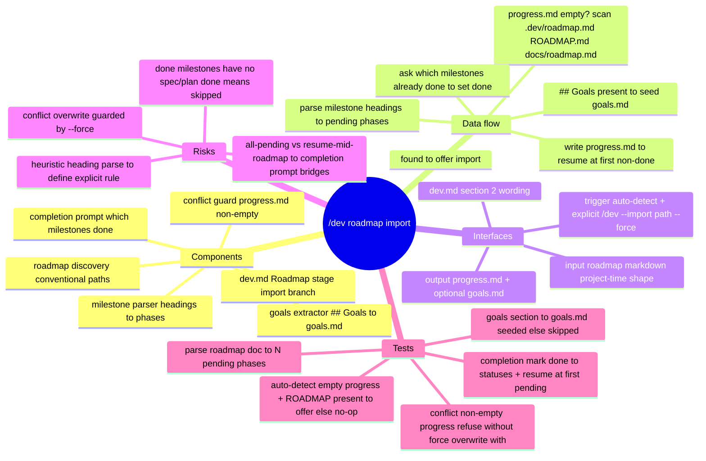

# Spec: `/dev` roadmap import

Date: 2026-06-17
Status: approved-pending (awaiting user sign-off → writing-plans-time)

## Mind map (approved)



## Purpose

Let `/dev` seed `.dev/memory/progress.md` from an **existing roadmap document**
instead of re-running `project-time`, so a user who already has a roadmap can
start the loop — and resume at a mid-roadmap milestone — without re-interviewing.

Closes the first of the two resume gaps identified earlier (roadmap not in
`progress.md`). The *status-aware resume* gap (resuming a `planned`/in-flight
phase at its existing plan) is explicitly **out of scope** here.

## Decisions (locked with user)

1. **Input format — project-time roadmap doc.** Import parses milestone headings
   from a markdown roadmap (the shape `project-time` emits) into `progress.md`
   phases, all seeded `pending`.
2. **Trigger — auto-detect**, with an explicit override. On `/dev` start, if
   `progress.md` has no phases, scan conventional roadmap paths and offer to
   import. An explicit `/dev --import <path>` (optionally `--force`) also works.
3. **Conflict — refuse unless `--force`.** If `progress.md` already has phases,
   auto-detect stays silent and explicit import refuses without `--force`.
4. **Scope — `progress.md` + optional `goals.md`.** Always seed the phase list;
   additionally seed `goals.md` if the roadmap file has a `## Goals` section.
5. **Completion prompt (the bridge).** Because parsed phases are all `pending`,
   immediately after import `/dev` asks which milestones are already complete and
   marks those `done`, so the loop resumes at the first incomplete milestone.

## Architecture

This is a behavior addition to the **`/dev` orchestrator prose**
(`pipelines/dev-pipeline/commands/dev.md`, the Roadmap stage §2) plus a one-line
addition to the `progress.md` writer-domain in
`pipelines/dev-pipeline/memory-protocol.md` (import becomes a recognized seeder,
alongside `project-time`). No new agent, no new command, no executable parser —
the orchestrator (the model) performs the parse following the rules below. This
keeps the change to documentation/instructions, consistent with how the rest of
`/dev` is specified.

### Roadmap discovery (auto-detect)

When `progress.md` has no phases, scan these paths in order and use the first that
exists:

1. `.dev/roadmap.md`
2. `ROADMAP.md` (repo root)
3. `docs/roadmap.md`

If one is found, offer: *"Found `<path>`. Import it as the phase list?"* If none is
found, fall through to the existing behavior (run `project-time` for a
multi-feature idea, or a single phase).

### Milestone parse rule (explicit)

From the chosen roadmap file, a **phase** is each markdown heading at the
**shallowest heading level that has ≥2 occurrences** whose text matches a
milestone pattern: it begins with `Milestone`, or `M<number>`, or `Phase`, or a
leading `<number>.`/`<number>)` (case-insensitive). The phase name is the heading
text with any leading `Milestone N:` / `M1 -` / `1.` ordinal stripped, trimmed.
Headings are taken in document order; that order is the phase order. If no heading
matches the pattern, import reports that it could not identify milestones and
falls back to the existing §2 behavior (do not guess).

### Goals extraction (optional)

If the roadmap file contains a `## Goals` section (a heading whose text is exactly
`Goals`, any level), copy its body (until the next heading of the same-or-shallower
level) into `goals.md`. If absent, leave `goals.md` empty. Never overwrite a
non-empty `goals.md`.

### Completion prompt

After writing the parsed phases (all `pending`), present the numbered phase list
and ask: *"Which of these milestones are already complete? I'll mark them `done` so
/dev resumes at the first incomplete one. (e.g. `1-3`, or `none`.)"* Mark the named
phases `done` in `progress.md`. The orchestrator owns these writes (per the
memory-protocol writer-domain).

### Conflict guard

Before writing, if `progress.md` already lists any phase:
- **Auto-detect path:** do not offer import at all (silent — protects in-flight work).
- **Explicit `--import` path:** refuse with *"`progress.md` already has phases;
  re-run with `--force` to overwrite."* With `--force`, replace the phase list
  wholesale (statuses reset per the new import + completion prompt).

## Data flow

```
/dev [--import <path>] [--force] "<idea>"
  read progress.md
  if progress.md has phases:
        if explicit --import and not --force -> refuse (conflict guard)
        else if no --import -> normal phase loop (resume)        # unchanged
  if progress.md empty:
        path = --import value, else first existing of
               .dev/roadmap.md, ROADMAP.md, docs/roadmap.md
        if no path -> existing §2 (project-time / single phase)  # unchanged
        offer import (auto-detect) or proceed (explicit)
        parse milestone headings -> phases (pending), in doc order
        if file has ## Goals and goals.md empty -> seed goals.md
        write progress.md
        completion prompt -> mark named phases done
  -> enter phase loop at first non-done phase
```

## Interfaces

- **Input:** a markdown roadmap file (project-time shape) at an explicit `--import`
  path or a conventional location.
- **Output:** `.dev/memory/progress.md` (seeded phase list with statuses);
  optionally `.dev/memory/goals.md`.
- **Trigger:** auto-detect on empty `progress.md`; explicit `/dev --import <path>
  [--force]`.
- **Touched docs:** `pipelines/dev-pipeline/commands/dev.md` (Roadmap stage §2 +
  a short "Import" subsection); `pipelines/dev-pipeline/memory-protocol.md`
  (`progress.md` writer-domain now names import as a seeder).

## Error handling

- **No milestones parsed** → report, fall back to existing §2 behavior; do not
  fabricate phases.
- **`progress.md` already populated** → conflict guard (above).
- **Roadmap file missing at an explicit `--import` path** → report the bad path,
  stop (do not silently auto-detect a different file).
- **`goals.md` already non-empty** → skip goals seeding, keep existing.

## Testing

Bash check scripts under `tests/dev/` (the repo's existing test style — assertions
over the doc text + small parse simulations):

- **Parse rule documented** — `dev.md` states the milestone-heading rule, doc-order
  phase extraction, and the all-`pending` seeding.
- **Auto-detect documented** — `dev.md` lists the three conventional paths and the
  "offer import" behavior, gated on empty `progress.md`.
- **Conflict guard documented** — `dev.md` states refuse-unless-`--force` for
  explicit import and silent-skip for auto-detect when `progress.md` is populated.
- **Completion prompt documented** — `dev.md` states the post-import "which are
  done?" step and that it marks phases `done`.
- **Goals optional documented** — `dev.md` states `## Goals` → `goals.md`, skip if
  absent or if `goals.md` non-empty.
- **Writer-domain updated** — `memory-protocol.md` names import (alongside
  project-time) as a `progress.md` seeder.
- **Parse simulation** — a fixture roadmap with 4 milestone headings + a `## Goals`
  section, run through the documented rule, yields 4 phases in order and a goals
  body (validated by a small bash/grep harness, not a live `/dev` run).

## Open questions

None — all four design choices plus the completion-prompt bridge are locked.
