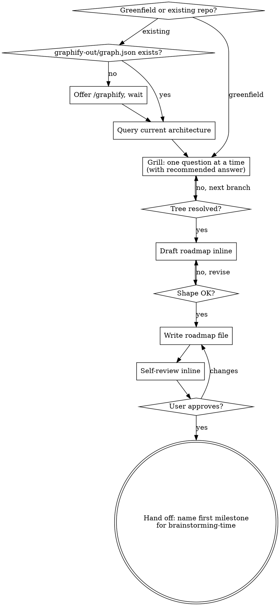

# Project Time

Turn a project-sized idea into a reviewable **technical roadmap** before any feature-level work. Sits one stage above [[brainstorming-time]] in the chain:

`project-time → brainstorming-time (per milestone) → writing-plans-time → executing-plan-time`

The roadmap answers the questions that should NOT be re-litigated inside every feature brainstorm — tech stack, system shape, data model spine, deployment model, scope boundaries, non-functional targets — and slices the work into milestones the rest of the chain can consume one at a time.

<HARD-GATE>
Do NOT write code, scaffold, generate file trees, or invoke any downstream skill (brainstorming-time, writing-plans-time, executing-plan-time) until the user has approved the roadmap file. This applies regardless of how small the project looks.
</HARD-GATE>

## When to Use

Use this skill when:
- The user describes a **whole project**, product, or multi-feature initiative — not a single change to an existing system
- The user has an idea but hasn't picked a stack, architecture, or scope boundary
- A roadmap with milestones would let the rest of the chain proceed one slice at a time
- You're about to start brainstorming-time and realize the scope is too big for a single spec

Use [[brainstorming-time]] directly (skip this skill) when:
- The work is a single feature or change inside an existing codebase
- The architecture, stack, and scope are already settled
- One spec → one plan → one execution cycle is enough

## Checklist

Create a TodoWrite todo for each item and complete them in order:

1. **Detect mode** — greenfield (no repo / empty repo) or existing-codebase. In existing-codebase mode, check `graphify-out/graph.json`; if missing, offer `/graphify` and wait
2. **Gather current-state context** — existing-codebase mode only: use `graphify query` to learn the current architecture before asking architecture questions
3. **Grill the user, one question at a time** — walk the topic tree below; for every question give your **recommended answer** with a one-line rationale; resolve dependencies between answers as you go
4. **Synthesize the roadmap** — once the tree is resolved, draft the roadmap inline (architecture diagram + milestones) and present it for review
5. **Iterate the roadmap shape** — fix milestone slicing, missing risks, or wrong tech calls in the inline draft before writing the file
6. **Write the roadmap file** — `docs/roadmaps/YYYY-MM-DD-<project-slug>.md` (user preferences override)
7. **Self-review inline** — placeholder scan, milestone independence check, every open question either answered or explicitly deferred to a milestone's brainstorm
8. **User review gate** — loop until the user approves the file
9. **Hand off** — tell the user the exact invocation for the first milestone: `Use brainstorming-time on milestone M1: <name>`. Do not invoke brainstorming-time yourself.

## Process Flow



Terminal state: an approved roadmap file plus the named hand-off invocation. The skill does NOT loop through milestones and does NOT invoke brainstorming-time itself.

## The Interview (grill-me style)

**Style.** Adapted from `grill-me`: ask one question at a time, walk down each branch of the decision tree, resolve dependencies between decisions before moving on, and **always offer your recommended answer** with a one-line rationale so the user can confirm/redirect instead of writing from scratch.

**Rules of the grill:**
- One question per message. Never batch.
- Every question has a recommended answer and a rejected alternative (one sentence each).
- If a question can be answered by exploring the codebase, **answer it from `graphify query` instead of asking** (existing-codebase mode).
- If two branches depend on each other, ask the upstream one first.
- Stop when every topic below is resolved, not before.

**Topic tree (walk in order; skip branches the user has already settled):**

1. **Outcome** — what does success look like in one sentence? Who is the user? What is the smallest version that's still valuable?
2. **Scope boundary** — what is explicitly **out** of scope for v1? (This is the question users skip and regret.)
3. **Runtime shape** — CLI, library, web app, service, daemon, mobile, embedded, hybrid?
4. **Tech stack** — language, framework, DB, key libraries. Recommend defaults; flag where the choice is load-bearing for later milestones.
5. **System architecture** — one diagram's worth: components, data flow, external interfaces. ASCII or Mermaid inline; resolve before writing the roadmap.
6. **Data model spine** — the 3–7 nouns the system is built around. Not full schemas; just the entities and how they relate.
7. **External dependencies** — third-party APIs, auth providers, payment, storage, etc. Each one is a risk row in the roadmap.
8. **Non-functional targets** — scale (users / req-per-second / data volume), latency budget, availability target, security/compliance posture, offline behavior, multi-tenant or not.
9. **Deployment model** — where it runs, how it ships, how it's observed. CI/CD shape.
10. **Milestone slicing strategy** — vertical slices (each milestone ships end-to-end value) vs. horizontal (foundation → features). Recommend vertical by default; explain why.
11. **Risks and assumptions** — top 3 things most likely to invalidate the plan.

When every topic above has a confirmed answer, the tree is resolved. Proceed to the draft.

## Roadmap File

**Path:** `docs/roadmaps/YYYY-MM-DD-<project-slug>.md` (user preferences override).

**Required sections, in this order:**

1. **Vision** — one paragraph, plus the in/out scope list for v1.
2. **Tech stack & rationale** — table: choice | alternative rejected | one-line rationale.
3. **System architecture** — Mermaid `flowchart` or `graph` (preferred) or ASCII; component boxes + data flow arrows + external interfaces.
4. **Data model spine** — entity list with one-line purpose and key relationships. No column-level schemas.
5. **Non-functional targets** — table or bullets: scale, latency, availability, security/compliance, offline, multi-tenant.
6. **Risks & assumptions** — numbered list; each names the milestone that retires it.
7. **Milestones** — see format below.
8. **Open questions deferred to milestone brainstorms** — explicit list with the milestone ID that will resolve each.

### Milestone format

Each milestone is sized so it can be fed to [[brainstorming-time]] as a single "idea":

```markdown
### M<N> — <Name>

- **Goal:** one sentence outcome.
- **Scope in:** bullets.
- **Scope out:** bullets (especially carve-outs that look in-scope).
- **Already decided at roadmap level:** the architectural decisions this milestone inherits — these are NOT to be re-opened in its brainstorm.
- **Open questions for brainstorming-time:** the questions deliberately deferred to the feature-level brainstorm.
- **Depends on:** [M<k>, ...] or "none".
- **Definition of done:** the observable signal that this milestone is complete.
- **Hand-off:** `Use brainstorming-time on milestone M<N>: <Name>`
```

**Milestone sizing rule.** A milestone should fit one brainstorming-time → writing-plans-time → executing-plan-time cycle. If a milestone has more than ~5 "Scope in" bullets or more than ~3 deferred questions, split it.

**Milestone independence rule.** A later milestone may depend on an earlier one's *output* (e.g., M2 needs the data model M1 introduces), but no two milestones should be entangled such that you must brainstorm them together.

### Self-review (inline, no separate pass)

Before showing the user the file path:

- Any `TBD`, `TODO`, or vague requirement? Replace, remove, or move it to "Open questions deferred to milestone brainstorms" with a milestone ID.
- Every milestone testable for "done" by an outside observer?
- Every risk retired by some milestone?
- Every entity in the data model used by some milestone?
- Every tech-stack choice rationale a sentence, not a paragraph?

Fix in place. Don't loop on self-review.

### User review gate

> "Roadmap written to `<path>`. Please review and tell me if you want changes before I name the first milestone for `brainstorming-time`."

Loop until the user approves. Then output the hand-off line — do NOT invoke `brainstorming-time` yourself.

## How This Differs From brainstorming-time

| project-time | brainstorming-time |
|---|---|
| Input: project / multi-feature idea | Input: one feature or change |
| Output: roadmap with N milestones | Output: one spec |
| Resolves architecture, stack, scope **once** for the whole project | Assumes architecture is settled |
| Grill style: one question at a time, with recommended answer | Batched questions in one message |
| Visual: architecture diagram | Visual: mind map of one design |
| Hand-off: names the first milestone for brainstorming-time | Hand-off: invokes writing-plans-time |
| Terminal state: approved roadmap file | Terminal state: approved spec file |

## Red Flags — Stop and Course-Correct

- About to produce a roadmap with **one milestone** → that's a spec; stop and use brainstorming-time instead.
- About to write the roadmap before the topic tree is resolved → finish the grill first.
- Asking a question without a recommended answer → that's interrogation, not grilling; add the recommendation.
- Batching questions to "go faster" → that's brainstorming-time's style; one at a time here.
- Filling in milestone-level detail (function signatures, file lists, test cases) → that's writing-plans-time's job; the roadmap stays at architectural granularity.
- Skipping the scope-out list because "we'll figure it out" → this is the single highest-value section of the roadmap. Do not skip.
- Invoking brainstorming-time before the user approves the roadmap file → hard gate violation.
- Roadmap doesn't name a tech stack because "the team will decide later" → that decision belongs in this skill; resolve it now or explicitly mark it as a Milestone 0 spike with a deadline.

## Rationalizations & Reality

| Excuse | Reality |
|---|---|
| "This is small, I can skip to brainstorming-time" | If it has milestones, it's not small. If it has one milestone, you don't need this skill. |
| "I'll let each milestone pick its own stack" | Then you don't have a project, you have N unrelated projects. Pick the stack here. |
| "Scope-out is obvious" | The user and you have different obvious. Write it down. |
| "Architecture is implementation detail" | At roadmap level: shape, not signatures. Diagram is required. |
| "I can answer this from the codebase without asking" | Then do — that's correct behavior in existing-codebase mode. Don't ask what `graphify query` can answer. |
| "Milestones should be horizontal (build the foundation first)" | Default to vertical slices so each milestone ships value. Pick horizontal only with stated reason. |

## Key Principles

- **One grill, then a roadmap.** Resolve project-level questions once, in one place, so feature-level brainstorms stop re-litigating them.
- **Recommended answer always.** Confirming a recommendation is faster than answering a blank question.
- **Architecture at roadmap granularity.** Components and data flow, not function signatures.
- **Vertical milestone slices.** Each milestone should ship something observable.
- **Defer the right things.** Minute technical detail belongs in brainstorming-time and writing-plans-time. The roadmap closes the big questions and names which small questions belong to which milestone.
- **Hard gate holds.** No downstream skill invocation until the roadmap file is approved.
