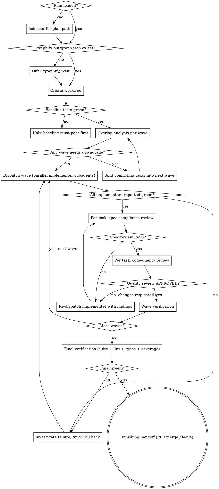

# Direct Executing Plans

One skill that runs an approved plan to done. Replaces the chain of superpowers:using-git-worktrees → superpowers:executing-plans → superpowers:subagent-driven-development → superpowers:dispatching-parallel-agents → superpowers:test-driven-development → superpowers:verification-before-completion → superpowers:finishing-a-development-branch with a single runner.

**Announce at start:** "I'm using the executing-plan-time skill to run the plan."

**Inputs:**
- A written, approved plan file (preferably produced by writing-plans-time, which already includes the File Edit Manifest + wave structure).
- A repo with (or willing to initialize) a graphify graph.

**Dispatched agents (in `pipelines/dev-pipeline/agents/`):**
- `implementer` (pipelines/dev-pipeline/agents/implementer.md) — the per-task implementer subagent. Worktree-aware, manifest-constrained, enforces the TDD-before-commit contract.
- `spec-reviewer` (pipelines/dev-pipeline/agents/spec-reviewer.md) — the spec-compliance reviewer. Also verifies manifest discipline and TDD-artifact integrity (re-runs the test on the parent commit to confirm it would have failed).
- `code-quality-reviewer` (pipelines/dev-pipeline/agents/code-quality-reviewer.md) — the code-quality reviewer. Also checks for sibling-task conflicts when the task ran inside a parallel wave.

Every implementer dispatch MUST dispatch the `implementer` agent by name. Every task MUST pass both reviewers in order (spec first, then quality) before being marked done. Skipping a reviewer is a hard-gate violation — see below.

<HARD-GATE>
Four hard gates. Violating any of them is a stop-the-line event:

1. **Worktree gate.** No edits to the main checkout. All work happens inside a git worktree created by this skill.
2. **TDD-before-commit gate.** A task does not commit unless a test that exercises the change was written, observed to fail, and then observed to pass — in that order. The fail log + pass log + commit triple is the artifact.
3. **Overlap gate.** Two tasks run in parallel only if overlap analysis (files + functions + call-graph edges) shows zero conflict. When in doubt, serialize.
4. **Two-stage review gate.** A task is not done until the `spec-reviewer` agent returns PASS and then the `code-quality-reviewer` agent returns APPROVED. Spec review always runs before quality review.
</HARD-GATE>

## Why a single skill

Each of the seven sub-skills is correct in isolation, but chaining them per task forces re-loading the same discipline seven times. The cost is context. This skill keeps the discipline and pays the load cost once.

It also lets us state cross-cutting invariants that no individual skill can state (e.g. "the worktree set up in step 1 must be the one used by all parallel agents in step 4").

## Checklist

Create a TodoWrite todo for each phase. Each phase has its own internal steps.

1. **Pre-flight** — graphify exists, plan loaded, worktree created, baseline tests green, memory read (read `.dev/memory/` per `pipelines/dev-pipeline/memory-protocol.md` if present; pass memory pointers to each dispatched agent)
2. **Overlap analysis** — for every wave, verify file + function + call-graph disjointness; downgrade waves if needed
3. **Wave loop** — for each wave: dispatch parallel `implementer` agents, await all; per task run spec-compliance review (dispatch the `spec-reviewer` agent), fix loop if needed, then code-quality review (dispatch the `code-quality-reviewer` agent), fix loop if needed; verify the wave; mark tasks done
4. **Final verification** — full test suite + lint + type-check + spec coverage check on the worktree
5. **Finishing handoff** — present PR / merge-to-main / leave-as-worktree choice; do not act without user confirmation

## Process Flow



---

## Phase 1: Pre-flight

### 1.1 Graphify

```bash
test -f graphify-out/graph.json && echo present || echo missing
```

If missing, stop and offer:

> "No graphify graph found. I need it for overlap analysis (function-level + call-graph) before dispatching parallel agents. OK to run `/graphify`?"

If the user declines, fall back to file-level overlap only and note this limitation. Function-level and call-graph overlap checks will be skipped — say so out loud, since the skill's parallelization safety is degraded.

If the graph exists but the repo has changed substantially since it was built, run `graphify --update` first.

### 1.2 Worktree (always)

```bash
git worktree add -b exec/<plan-slug>-<yyyymmdd> ../<repo>-exec-<slug>
cd ../<repo>-exec-<slug>
```

All subsequent work — every read, every edit, every commit, every test run — happens inside this worktree. The main checkout is untouched.

If a worktree for the same plan already exists, ask the user whether to resume it or create a fresh one. Never silently reuse.

### 1.3 Baseline tests green

Run the project's test command inside the worktree before doing anything else. If baseline is red:

> "Baseline tests are failing on `<branch>` before any changes. I'm halting — fixing pre-existing failures is not in this plan's scope, and proceeding would conflate failures."

Wait for user direction. Do not start the plan.

### 1.4 Context discipline

From this point on, the main agent (you) does **not** read source files directly except to inspect the plan itself, the graphify query results, and the short status reports returned by subagents. All file edits, test runs, and commits happen inside dispatched subagents — the main context never accumulates code.

Concrete rules for the main agent:
- Do not call Read on source files. Use `graphify query` for understanding.
- Do not call Edit/Write on source files. Dispatch a subagent.
- Do not run the full test suite from main except at the final verification step. Per-task tests run inside the subagent.

### 1.5 Memory protocol

Read `.dev/memory/` per `pipelines/dev-pipeline/memory-protocol.md` if present; pass memory pointers to each dispatched agent. No-op when absent.

---

## Phase 2: Overlap Analysis (per wave)

The plan declares waves and file-level disjointness. This phase **verifies** that and adds two stronger checks.

For every pair of tasks (T_a, T_b) intended to run in the same wave, all three must hold:

| Check | How | Mandatory |
|-------|-----|-----------|
| **File-disjoint** | `files(T_a) ∩ files(T_b) == ∅` | Yes |
| **Function-disjoint** | No function/symbol appears in both `functions(T_a)` and `functions(T_b)` via `graphify query "what functions live in <file>"` | Yes |
| **No cross-edge** | No symbol modified by T_a is called by any file modified by T_b (and vice versa) via `graphify query "what calls <symbol>"` | Yes |

If any check fails for a pair, **demote the later task to the next wave**. Re-run analysis. Repeat until all waves are clean.

The cross-edge check is what catches the case where T_a renames `parseConfig` and T_b modifies a caller of `parseConfig` — file-disjoint but logically racing.

Document the analysis result in a short note before dispatching:

```
Wave 2 overlap check:
- T2 vs T3: files disjoint ✓, functions disjoint ✓, no cross-edges ✓ → parallel OK
- T2 vs T4: T4 calls T2.serialize → cross-edge → T4 demoted to W3
```

---

## Phase 3: Wave Loop

For each wave, in order:

### 3.1 Dispatch parallel implementer subagents

Send **all tasks in the wave as a single message with multiple Agent tool calls**. Dispatch the `implementer` agent (pipelines/dev-pipeline/agents/implementer.md) by name with the task slice — do not write ad-hoc instructions. Each dispatch gets:

- The worktree absolute path and branch (Phase 1.2)
- The full task text from the plan (verbatim — do NOT have the subagent read the plan file)
- The task's File Edit Manifest entries (Create / Modify / Test / Delete)
- Pre-queried graphify context (functions defined in modified files, callers, callees) — run these queries once in main BEFORE dispatching, paste the results into each dispatch

The `implementer` agent already enforces the TDD-before-commit contract (3.2) and the manifest constraint. Do not weaken it; do not skip required context. If a context slot doesn't apply, write "none" — never leave it blank or invent a value.

### 3.2 TDD-before-commit (the contract)

Encoded inside the `implementer` agent. Restated here for visibility — every task's commit MUST be backed by:

1. A test file change (new test or modified test in the manifest's Test file).
2. **Fail log:** observed test failure output before implementation, run on the not-yet-modified branch state.
3. **Pass log:** observed test pass output after implementation, run on the post-implementation worktree state.
4. A single commit containing both the test and the implementation, with a message tying it to the task ID.

If an implementer returns without all four, the task is **not done**. Either re-dispatch with the missing artifact explicitly requested, or roll back the commit and re-dispatch fresh.

Never accept "I tested it manually" or "the test passed but I didn't capture the output." The artifact is the fail log → pass log → commit triple. The spec-compliance reviewer (3.4) will verify this by re-running the test on the parent commit.

### 3.3 Await all + verify wave-level integration

Collect statuses (≤20-line reports) from every implementer in the wave. Then, from main, run only what's needed to verify the wave integrates:

```bash
# In the worktree
git log --oneline <wave-base>..HEAD   # confirm one commit per task
git diff --stat <wave-base>..HEAD     # confirm changed files match the manifest entries for this wave
<project-test-command-for-touched-areas>
```

If wave verification fails: investigate. Common causes:
- A subagent's test passes in isolation but conflicts with another subagent's change → the overlap check missed something; demote one task to the next wave and re-run.
- A commit touched files outside the manifest → roll back that task's commit, re-dispatch with the manifest constraint re-emphasized.

### 3.4 Per-task spec-compliance review

For each task in the wave, dispatch the `spec-reviewer` agent (pipelines/dev-pipeline/agents/spec-reviewer.md) by name. Reviewers for different tasks in the same wave can run in parallel (they read disjoint diffs).

Provide:
- Worktree path
- Base SHA (commit immediately before this task's commit) and head SHA (the task's commit)
- The full task text from the plan
- The task's File Edit Manifest
- The implementer's full status report

The reviewer returns `PASS` or `FAIL` with specific findings. If `FAIL`:
- Re-dispatch the same implementer (fresh subagent, same model unless the failure suggests a more capable model is needed) with the reviewer's findings as additional context.
- Re-run the spec review until `PASS`.

Do NOT proceed to code-quality review on a `FAIL`. Do NOT silently fix the issues yourself in main — dispatch a subagent.

### 3.5 Per-task code-quality review

Only after spec review returns `PASS` for a given task, dispatch the `code-quality-reviewer` agent (pipelines/dev-pipeline/agents/code-quality-reviewer.md) by name.

Provide:
- Worktree path, base SHA, head SHA
- One-paragraph task summary
- **Sibling-task touch sets** — the files modified by every other task in this same wave. This is what the upstream code-quality reviewer does not have visibility into and is why this agent includes a sibling-conflicts check.

The reviewer returns `APPROVED` or `CHANGES_REQUESTED`. If `CHANGES_REQUESTED`:
- Re-dispatch the implementer with the findings.
- Re-run code-quality review until `APPROVED`.
- If only Minor issues remain, the reviewer allows `APPROVED` with the minors noted for follow-up (non-blocking).

### 3.6 Mark done + context hygiene between waves

A task is marked done in TodoWrite only after both reviewers green-light it. Then summarize the wave in 3–5 lines (tasks, files touched, peak parallelism, any reviewer iterations) and discard the per-task status blobs and reviewer reports from working memory.

The next wave's implementer subagents only need: the next task slice, the worktree path, and any new graphify context.

---

## Phase 4: Final Verification

Before any finishing action, from main, in the worktree:

```bash
# Full test suite
<project test command>

# Lint
<project lint command>

# Type-check (if applicable)
<project type-check command>

# Optional: spec coverage check
# For each requirement in the spec, confirm at least one commit references it
git log --oneline <main>..HEAD | grep -iE "<requirement-keywords>"
```

All must pass. If any fail:
- Do NOT proceed to finishing.
- Dispatch a single subagent to investigate, following the TDD-before-commit contract for any fix.
- Re-run final verification.

State the final verification result explicitly. No "it should be working" — evidence before claims.

---

## Phase 5: Finishing Handoff

After final verification is green, present the choice. Do not act without the user picking one.

**Branch-integrity precheck (do this first, before any merge/PR).** A subagent may have detached the worktree HEAD during the run, leaving the branch ref behind the real work — merging the ref would then ship only part of the plan. Confirm the branch label actually points at the work tip:

```bash
git -C <worktree> rev-parse HEAD          # the real work tip
git -C <worktree> rev-parse <branch>      # the branch label
git -C <worktree> symbolic-ref -q HEAD || echo "DETACHED HEAD"
```

If `HEAD` is detached or the two SHAs differ, repoint the branch before finishing:

```bash
git -C <worktree> branch -f <branch> <work-tip-SHA>
```

Then, after any merge, re-check the merge diffstat covers **every** task in the plan — not just the early ones.

> "Plan complete and verified on worktree `<path>` (branch `<branch>`). Summary: <N> tasks across <W> waves, peak parallelism <P>, all tests green, lint clean.
>
> Finishing options:
>
> 1. **Open a PR** against `<base-branch>` — push the branch and create a PR (I'll draft title + summary).
> 2. **Merge to `<base-branch>`** — fast-forward / merge / rebase your preference, then optionally remove the worktree.
> 3. **Leave as worktree** — keep the branch and worktree as-is for further iteration.
>
> Which?"

For option 1: push the branch, run `gh pr create` with a generated title + summary derived from the plan, return the PR URL.

For option 2: ask which merge style (`--ff-only`, `--no-ff`, rebase), do the merge, then ask whether to `git worktree remove` the worktree.

For option 3: print the worktree path and branch name and stop.

---

## Ponytail Integration (Required)

Ponytail (minimal-code enforcement) runs at mode `full`. Every implementer and reviewer dispatch operates under its decision ladder, applied in order before any line is written:

1. Does this need to exist? (If not, don't write it.)
2. Does the standard library solve it?
3. Is there a native platform/framework feature?
4. Is a dependency already installed that solves it?
5. Can it be one line?
6. Only then: the minimum viable implementation.

Because dispatched subagents may not inherit ponytail's global session hook, the ladder is stated explicitly in the `implementer` agent and the over-engineering check in the `code-quality-reviewer` agent — do not rely on the hook alone.

## Token & Context Discipline

This skill exists partly because chaining seven sub-skills wastes context. To keep main lean:

- **Main never reads source files.** Graphify queries + subagent reports are the only signal.
- **Per-task work is fully delegated.** Subagents return ≤5-line status, not full diffs.
- **Graphify queries run once per topic per session.** Cache the result in the message you pass to the next subagent rather than re-querying.
- **Per-wave summary is ≤5 lines.** Discard per-task blobs.
- **Verification commands run in the worktree, not in scratchpads.** Don't paste long outputs into main — paste pass/fail + the failing test name.
- **No code in main messages.** If you find yourself about to paste a function body into main context, dispatch a subagent instead.

Target: main context after a 10-task plan should be roughly the plan file + 10 status lines + 5 wave summaries + final verification log. Not 10 file diffs.

---

## Overlap Analysis — How to Query

For each task, precompute its **touch set** and **call set**:

```bash
# Touch set: files the task will modify (from the manifest, already known)
# Plus: functions defined in those files
graphify query "what functions are defined in <file>"

# Call set: symbols the task's modified code will call
graphify query "what does <symbol> depend on"

# Reverse calls: symbols that call into the task's modified code
graphify query "what calls <symbol>"
```

For wave admission, two tasks T_a, T_b can co-run iff:
- `files(T_a) ∩ files(T_b) = ∅`
- `defined_functions(T_a) ∩ defined_functions(T_b) = ∅`
- `(symbols_modified(T_a) ∩ symbols_called_by(T_b)) = ∅` AND symmetric

If any intersection is non-empty, serialize.

---

## Common Failure Modes

| Symptom | Likely Cause | Recovery |
|---|---|---|
| Two parallel subagents both modify the same line | File-overlap missed in plan; manifest entry too coarse | Roll back later commit, re-run analysis, demote |
| Test passes per-task but full suite fails after wave | Cross-edge missed by analysis (shared dependency renamed) | Add cross-edge check to the analysis, fix the broken caller in next wave |
| Subagent commits without showing failing test | TDD contract not enforced in dispatch prompt | Roll back commit, re-dispatch with explicit "show fail log" requirement |
| Main context bloats mid-execution | Main agent reading files instead of querying graphify | Stop, summarize current state in ≤10 lines, continue with discipline |
| Baseline was red when we started, masked by new failures | Skipped phase 1.3 | Stash current work, return to base, fix baseline first |
| "Final verification" was implicit ("should be fine") | Verification gate skipped | Run the suite explicitly, don't hand off without evidence |
| Merge to base brings only some tasks; branch ref lags the real work | An agent ran `git checkout <sha>` on the shared worktree → detached HEAD, later commits left the branch ref behind | Before finishing, assert worktree HEAD == branch tip (see Phase 5); if detached, `git branch -f <branch> <worktree-HEAD>` then merge |

---

## How This Differs From the Seven Original Skills

| Original | What this skill keeps | What it adds |
|---|---|---|
| superpowers:using-git-worktrees | Always-isolate-in-worktree rule | Worktree creation is phase 1, not a separate skill load |
| superpowers:executing-plans | Plan-driven execution | Merged into the wave loop |
| superpowers:subagent-driven-development | Per-task fresh subagent + 3 named agents (implementer, spec-reviewer, code-quality-reviewer) | Agents live in `pipelines/dev-pipeline/agents/`, adapted to require worktree path, pre-queried graphify context, TDD artifact integrity check (re-run on parent commit), manifest-discipline check, and sibling-task conflict check |
| superpowers:dispatching-parallel-agents | Parallel-when-independent | File + function + call-graph overlap check, not just "looks independent" |
| superpowers:test-driven-development | Test-first, see-it-fail, see-it-pass | Enforced as a contract on every dispatched subagent, with an artifact check |
| superpowers:verification-before-completion | Evidence before claims | Promoted to a phase with explicit commands and a gate |
| superpowers:finishing-a-development-branch | PR / merge / leave options | Triggered only after final verification is green |

---

## Red Flags — Stop and Course-Correct

- Editing files in the main checkout instead of the worktree
- A task commit with no failing-test log preceding it
- Two parallel implementers touching the same file
- Implementer returns "done" without fail + pass logs → not done
- Skipping the spec reviewer or running code-quality before spec → hard-gate violation
- Skipping the sibling-task touch-sets in the code-quality reviewer dispatch — the agent's parallel-aware check will silently degrade to upstream behavior
- Writing ad-hoc subagent prompts instead of dispatching the named `implementer` / `spec-reviewer` / `code-quality-reviewer` agents
- Main agent reading source files directly → use graphify
- Main agent fixing reviewer findings itself instead of re-dispatching the implementer (context pollution)
- "Final verification" being a sentence instead of a command run
- Handing off to finishing before running the full suite
- Reusing an old worktree without asking the user
- Skipping graphify and parallelizing on file-disjointness alone (cross-edge races will bite)
- Implementer adds an unrequested abstraction, option, or speculative code → ponytail violation; re-dispatch with the minimal-code ladder re-emphasized
- Any agent running `git checkout` on the **shared** worktree (e.g. a reviewer "checking out the parent to verify TDD") → detaches HEAD, races siblings, and orphans the branch ref so later commits land off-branch. Verify parent-commit behavior in a throwaway `git worktree add --detach`, never by checking out the shared worktree.

---

## Key Principles

- **Worktree always.** Main checkout is read-only for the duration.
- **TDD is a contract, not a suggestion.** No fail-log + pass-log + commit triple → not done.
- **Parallelism requires proof.** File-disjoint + function-disjoint + no cross-edges. When in doubt, serialize.
- **Main stays light.** Read via graphify, edit via subagents, status in ≤5 lines.
- **Evidence before finishing.** Full suite + lint + types green, on the worktree, before any PR or merge.
