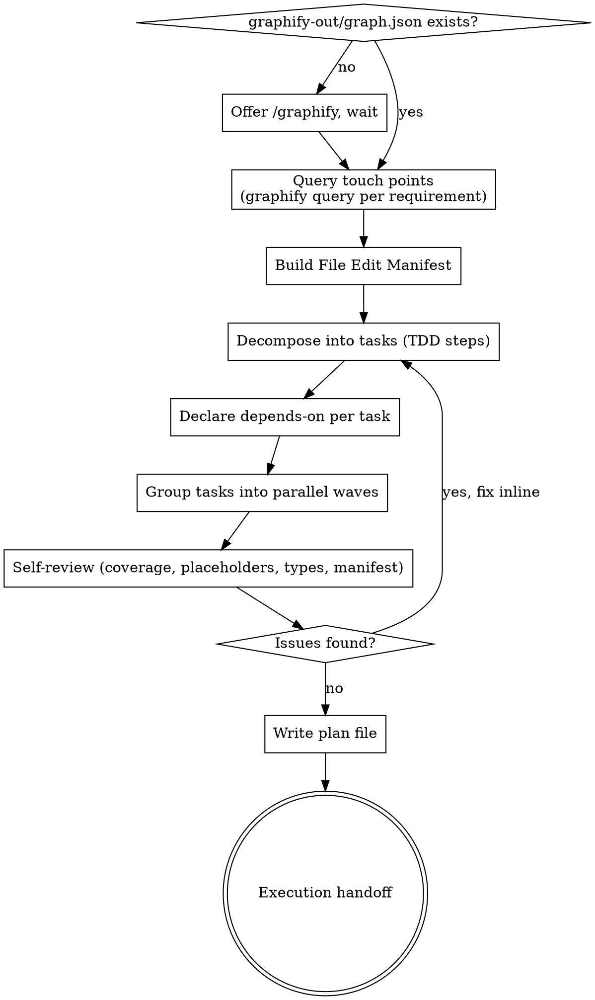
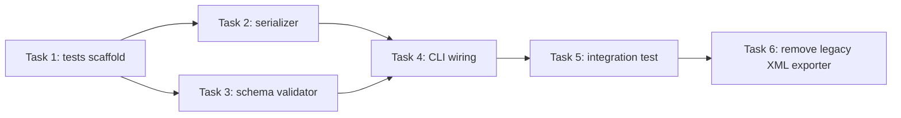

# Direct Writing Plans

Turn an approved spec into a concrete implementation plan, fast. Same guarantees as superpowers:writing-plans (bite-sized steps, exact code, TDD, frequent commits), with three differences:

1. **Graphify-first.** The plan's file list comes from `graphify query`, not guesswork. If no graph exists, initialize one before planning.
2. **File Edit Manifest up front.** Before any tasks, the plan declares every file it will create, modify, or delete. The reader knows the blast radius before reading step 1.
3. **Parallelization-aware.** Tasks declare `depends-on`. The plan groups them into waves; tasks in the same wave can be dispatched to parallel subagents.

**Announce at start:** "I'm using the writing-plans-time skill to create the implementation plan."

**Save plans to:** `docs/plans/YYYY-MM-DD-<feature-name>.md` (user preferences override).

**Companion template (in this skill folder):**
- `plan-template.md` — the canonical plan structure that `executing-plan-time` consumes. Copy the section below the `===` line into your plan file and fill in the placeholders. Sections marked **REQUIRED** in the template (File Edit Manifest, Execution Waves, per-task `Depends-on:` / `Wave:` / `Files:`) are what the executor reads for overlap analysis and parallel dispatch — omitting them forces sequential fall-back.

<HARD-GATE>
Do NOT begin implementation. The terminal state of this skill is a written plan file plus an execution handoff. The implementation step belongs to superpowers:subagent-driven-development, superpowers:dispatching-parallel-agents, or superpowers:executing-plans — whichever the user picks.
</HARD-GATE>

## Checklist

Create a TodoWrite todo for each item and complete them in order:

1. **Ensure graphify graph exists** — check `graphify-out/graph.json`; if missing, offer to run `/graphify` and wait for the user before continuing
2. **Locate touch points via `graphify query`** — for each spec requirement, query for the files, callers, and dependents involved; do NOT enumerate files by grep/Read unless the query is insufficient
3. **Build the File Edit Manifest** — single table listing every file the plan will create / modify / delete, with one-line purpose and a "first task that touches it" column
4. **Decompose into tasks** — each task = one self-contained, testable change with TDD steps
5. **Declare dependencies** — every task lists `depends-on: [task-ids]` or `depends-on: none`
6. **Group into waves** — derive a parallelization DAG; tasks with no remaining dependencies form Wave 1, etc. Maximize wave width.
7. **Self-review** — spec coverage, placeholder scan, type-name consistency, manifest matches tasks, every file in the manifest is touched by some task and vice versa
8. **Write the plan file** — manifest first, then waves, then tasks
9. **Execution handoff** — offer parallel (default if >1 task in any wave) or sequential execution

## Process Flow



## Graphify Integration (Required)

This is what makes the plan trustworthy — the file list reflects the real graph, not a guess.

**Initialization gate.** Before any querying, check `graphify-out/graph.json`. If missing, stop and offer to run `/graphify` — "so the file manifest is grounded in the real call graph, not in grep guesses" — and **wait** for the reply. If declined, fall back to Read/Grep and note in the plan that the manifest may be incomplete.

**Per-requirement queries.** For each spec requirement, run at least:

```bash
graphify query "where is <concept> implemented"
graphify query "what calls <function/module>"
graphify query "what depends on <file>"
```

Record the touch set. Anything reachable from the touch set is a candidate for the manifest.

**Staleness.** If the repo has changed since the last graph build, suggest `graphify --update` before continuing.

## The File Edit Manifest (Required, First Section)

Open the plan with this table — before any task:

```markdown
## File Edit Manifest

| Path | Action | Purpose | First touched in |
|------|--------|---------|------------------|
| `src/export/csv.py` | Create | CSV serializer | Task 2 |
| `src/cli.py:42-78` | Modify | Wire `export csv` subcommand | Task 4 |
| `tests/export/test_csv.py` | Create | Unit tests for serializer | Task 1 |
| `src/legacy/export_xml.py` | Delete | Replaced by csv exporter | Task 6 |

**Out of scope (intentionally not touched):** `src/db/*`, `src/auth/*`.
```

Rules:
- Every file the plan touches appears exactly once.
- Every entry maps to a task; every task touches only files in this manifest.
- Include line ranges for modifies when known from graphify.
- The "Out of scope" line is required — it tells the reviewer what you decided NOT to touch.

## Task Structure (with dependencies)

````markdown
### Task N: [Component Name]

**Depends-on:** [task-1, task-2]   ← or `none`
**Wave:** W2
**Files:**
- Create: `exact/path/to/file.py`
- Modify: `exact/path/to/existing.py:123-145`
- Test:   `tests/exact/path/to/test.py`

- [ ] **Step 1: Write the failing test**
```python
def test_specific_behavior():
    result = function(input)
    assert result == expected
```
- [ ] **Step 2: Run test to verify it fails**
  Run: `pytest tests/path/test.py::test_name -v`
  Expected: FAIL with "function not defined"
- [ ] **Step 3: Write minimal implementation**
```python
def function(input):
    return expected
```
- [ ] **Step 4: Run test to verify it passes**
  Run: `pytest tests/path/test.py::test_name -v`
  Expected: PASS
- [ ] **Step 5: Commit**
```bash
git add tests/path/test.py src/path/file.py
git commit -m "feat: add specific feature"
```
````

## Parallelization (Required Section)

After tasks are written, derive waves. **Two tasks can be in the same wave iff none of them depends-on the other and they touch disjoint files** (file-disjointness is non-negotiable — overlapping edits race even when logical dependencies look clean).

Include this section in the plan:

````markdown
## Execution Waves



| Wave | Tasks | Parallelizable | Rationale |
|------|-------|----------------|-----------|
| W1 | T1 | n/a (single) | bootstrap tests |
| W2 | T2, T3 | yes — disjoint files | independent components |
| W3 | T4 | n/a | merges W2 outputs |
| W4 | T5 | n/a | end-to-end after wiring |
| W5 | T6 | n/a | cleanup last |
````

Rules:
- Aim to **maximize wave width** without violating file-disjointness or logical depends-on.
- If a wave has only one task, ask yourself: "could this task be split into independent sub-tasks that touch different files?" If yes, split it.
- If two tasks both modify the same file, keep them sequential even if logically independent — file-level serialization wins.

## No Placeholders

Same rules as superpowers:writing-plans. These are plan failures:
- `TBD`, `TODO`, "implement later", "fill in details"
- "Add appropriate error handling" / "handle edge cases" without specifics
- "Write tests for the above" without the test code
- "Similar to Task N" — repeat the code; tasks may be read out of order (and in parallel waves, will be)
- References to types/functions/methods not defined in any task
- Tasks without an explicit `Depends-on:` line
- Files modified outside the File Edit Manifest

## Self-Review (Inline, No Subagent)

After writing the plan, scan it once:

1. **Spec coverage** — every spec requirement maps to at least one task.
2. **Manifest ↔ tasks** — every file in the manifest is touched by some task; every file a task touches is in the manifest.
3. **Placeholder scan** — none of the patterns above.
4. **Type/name consistency** — `clearLayers()` in Task 3 must match `clearLayers()` in Task 7.
5. **Wave correctness** — re-check that same-wave tasks touch disjoint files and have no inter-dependencies.
6. **Wave width** — is any wave artificially narrow? Can a task be split?

Fix inline. Do not loop on self-review.

## Plan Document Header

```markdown
# [Feature Name] Implementation Plan

> **For agentic workers:** REQUIRED SUB-SKILL: Use `executing-plan-time` to run this plan. It handles worktree setup, overlap analysis, parallel-wave dispatch, per-task spec + code-quality review, and branch finishing in one runner. Steps use checkbox `- [ ]` syntax for tracking.

**Goal:** [One sentence]
**Architecture:** [2-3 sentences]
**Tech Stack:** [Key technologies]
**Max wave width:** [N tasks in parallel at peak]

---
```

## Execution Handoff

After saving the plan, hand off to `executing-plan-time`. That skill is the single entry point for executing plans produced here — it absorbs what used to be the three separate superpowers execution skills (dispatching-parallel-agents, subagent-driven-development, executing-plans) into one runner that always uses a worktree, always parallelizes when overlap analysis permits, and falls back to sequential within the same flow.

Message to the user:

> "Plan saved to `<path>`. Wave summary: W1=1 task, W2=2 parallel, W3=1, W4=1, W5=1 (peak parallelism: 2). Ready to hand off to `executing-plan-time` — it will set up a worktree, run overlap analysis on the waves, dispatch parallel oro-implementer subagents per wave, run spec-compliance and code-quality review per task, and finish the branch. Proceed?"

**Routing:** Always `executing-plan-time`. Do NOT invoke superpowers:dispatching-parallel-agents, superpowers:subagent-driven-development, or superpowers:executing-plans separately — they are subsumed.

## How This Differs From superpowers:writing-plans

| superpowers:writing-plans | writing-plans-time |
|---|---|
| File structure described in prose | Explicit File Edit Manifest table at top |
| Reads/greps for callers | `graphify query` first; initializes graphify if missing |
| Tasks listed sequentially, implicit ordering | Tasks declare `Depends-on:`; grouped into parallel waves |
| Handoff: subagent-driven OR executing-plans (three separate skills) | Single handoff to `executing-plan-time` (parallel waves + sequential fallback in one runner) |
| No "Out of scope" declaration | Required line in the manifest |

## Red Flags — Stop and Course-Correct

- Running Read/Grep before any `graphify query` → query first
- `graphify-out/` missing and you proceeded anyway → stop, initialize
- Skipping the File Edit Manifest "because the plan is small" → write it anyway, even if 2 rows
- A task modifies a file not in the manifest → add it to the manifest, don't silently expand scope
- Two tasks in the same wave touch the same file → split waves, file-disjointness is mandatory
- Every wave has exactly one task → you missed parallelization opportunities, look again
- Plan ends with "implement the rest similarly" → fill it in or split the task
- Handing off to implementation before saving the plan file → finish the artifact first

## Memory protocol (when run under /dev)

When this skill runs inside a `/dev` loop, read `.dev/memory/` before building the File Edit Manifest so the plan inherits prior decisions instead of re-deriving them. Append any planning decisions made while writing the plan to `.dev/memory/decisions.md` tagged `[interactive]` (see `pipelines/dev-pipeline/memory-protocol.md` for the full entry format, including the `phase<N>/<stage>:` prefix).

See `pipelines/dev-pipeline/memory-protocol.md` for the file formats. This step is a **no-op when `.dev/memory/` is absent** — the skill still runs standalone without it.

## Autonomous mode (under `/dev --auto`)

When the `/dev` orchestrator invokes this skill in autonomous mode, do not wait for the
user:

- **graphify-missing gate** — do not offer `/graphify`; fall back to file reads silently and
  note in the plan that the manifest may be incomplete. Run `graphify --update`
  non-interactively only if `graphify` is already installed.
- **Any approval/confirmation pause** — replaced by the inline self-review. After self-review
  passes, write the plan file and hand off directly to `executing-plan-time` (the orchestrator
  dispatches `oro-phase-executor`, which runs it unattended).
- Append any planning decisions to `.dev/memory/decisions.md` tagged `[auto]` (autonomous),
  not `[interactive]`.

This section is inert when the skill runs standalone (not under `/dev --auto`).

## Key Principles

- **Graph before grep.** The manifest is grounded in the call graph, not in guesses.
- **Manifest before tasks.** Declare the blast radius up front so the reviewer can object before reading 30 task steps.
- **Disjoint files = safe parallel.** Logical independence isn't enough; file-level disjointness is the parallelization invariant.
- **Wave width is a quality metric.** Narrow waves usually mean missed decomposition.
- **No silent scope creep.** Every touched file is in the manifest. Every manifest file is touched by a task.
- **Ponytail first rung.** Apply "does this need to exist?" to every task and file in the manifest; drop work that fails it rather than planning it.
