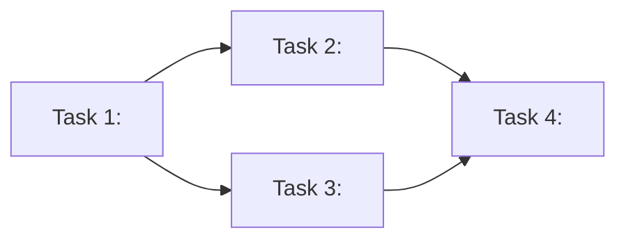

# Plan Document Template (writing-plans-time)

Fill in this template to produce a plan that `executing-plan-time` can consume directly.

Sections marked **REQUIRED** must be present. The File Edit Manifest, Execution Waves, and per-task `Depends-on:` / `Wave:` / `Files:` lines are what `executing-plan-time` reads to perform overlap analysis and parallel dispatch — leaving them out forces a fall-back to sequential execution.

Copy everything below the `===` line into `docs/plans/YYYY-MM-DD-<feature-slug>.md` and replace the bracketed placeholders.

===

# [Feature Name] Implementation Plan

> **For agentic workers:** REQUIRED SUB-SKILL: Use `executing-plan-time` to run this plan. It will set up a git worktree, run overlap analysis, dispatch parallel implementer subagents per wave, run spec-compliance and code-quality reviews per task, and finish the branch. Steps use checkbox `- [ ]` syntax for tracking.

**Goal:** [one sentence — what does this build]
**Architecture:** [2-3 sentences — the approach]
**Tech Stack:** [key technologies / libraries / frameworks]
**Source spec:** [path to the spec that produced this plan, e.g. `docs/specs/2026-05-31-csv-export.md`]
**Max wave width:** [N tasks in parallel at peak]

---

## File Edit Manifest (REQUIRED)

Every file the plan touches must appear here exactly once. Every task may only Create / Modify / Delete files listed here. `executing-plan-time` rejects out-of-scope edits.

| Path | Action | Purpose | First touched in |
|------|--------|---------|------------------|
| `<path>` | Create | <one-line purpose> | Task N |
| `<path>:<line-range>` | Modify | <one-line purpose> | Task N |
| `<path>` | Delete | <one-line purpose> | Task N |

**Out of scope (intentionally not touched):** `<path>`, `<path>`, `<path>`.

---

## Execution Waves (REQUIRED)

Tasks in the same wave run in parallel under `executing-plan-time`. Two tasks may co-exist in a wave only if they are file-disjoint, function-disjoint, and have no call-graph cross-edges. The DAG below is verified at runtime; this is the proposed grouping.



| Wave | Tasks | Parallelizable | Rationale |
|------|-------|----------------|-----------|
| W1 | T1 | n/a (single) | <why> |
| W2 | T2, T3 | yes — disjoint files | <why> |
| W3 | T4 | n/a | <why> |

---

## Tasks

### Task 1: [Component Name]

**Depends-on:** none
**Wave:** W1
**Files:**
- Create: `<exact/path/to/file.ext>`
- Modify: `<exact/path/to/existing.ext>:<lines>`
- Test:   `<tests/exact/path/to/test.ext>`

- [ ] **Step 1: Write the failing test**

```<lang>
def test_<specific_behavior>():
    result = function(input)
    assert result == expected
```

- [ ] **Step 2: Run test to verify it fails**

Run: `<exact test command>`
Expected: FAIL with `<exact expected error message>`

- [ ] **Step 3: Write minimal implementation**

```<lang>
def function(input):
    return expected
```

- [ ] **Step 4: Run test to verify it passes**

Run: `<exact test command>`
Expected: PASS

- [ ] **Step 5: Commit**

```bash
git add <exact paths>
git commit -m "feat(task-1): <one-line summary>"
```

---

### Task 2: [Component Name]

**Depends-on:** [task-1]
**Wave:** W2
**Files:**
- Create: `<path>`
- Modify: `<path>:<lines>`
- Test:   `<path>`

- [ ] **Step 1: Write the failing test**
```<lang>
<test code>
```

- [ ] **Step 2: Run test to verify it fails**

Run: `<command>`
Expected: FAIL with `<message>`

- [ ] **Step 3: Write minimal implementation**
```<lang>
<implementation code>
```

- [ ] **Step 4: Run test to verify it passes**

Run: `<command>`
Expected: PASS

- [ ] **Step 5: Commit**
```bash
git add <paths>
git commit -m "feat(task-2): <summary>"
```

---

<!-- Repeat the Task block for every task in the plan.
     One commit per task. No combined commits across tasks.
     Every Step that touches code MUST include the actual code, not a placeholder.
     References to types/functions defined in earlier tasks must use the exact name. -->

---

## Notes for the Author

- **No placeholders.** `TBD`, `TODO`, "add error handling", "similar to Task N" are plan failures. The implementer reads tasks out of order (and in parallel) — each task must be self-contained.
- **Manifest ↔ tasks must be bijective.** Every manifest entry is touched by some task; every file a task touches is in the manifest. `executing-plan-time` enforces this at the spec-review step.
- **Same-wave invariants.** Two tasks in the same wave: zero shared files, zero shared function symbols, zero call-graph cross-edges. If any check fails, demote the later task to the next wave.
- **Wave width is a quality metric.** A wave of one task that could have been split is a missed parallelization opportunity. A wave of three tasks that share a config file is a future merge conflict.
- **Type consistency across tasks.** A function named `clearLayers()` in Task 3 cannot be `clearFullLayers()` in Task 7. The code-quality reviewer will catch this at the per-task review, but it's cheaper to get it right in the plan.
